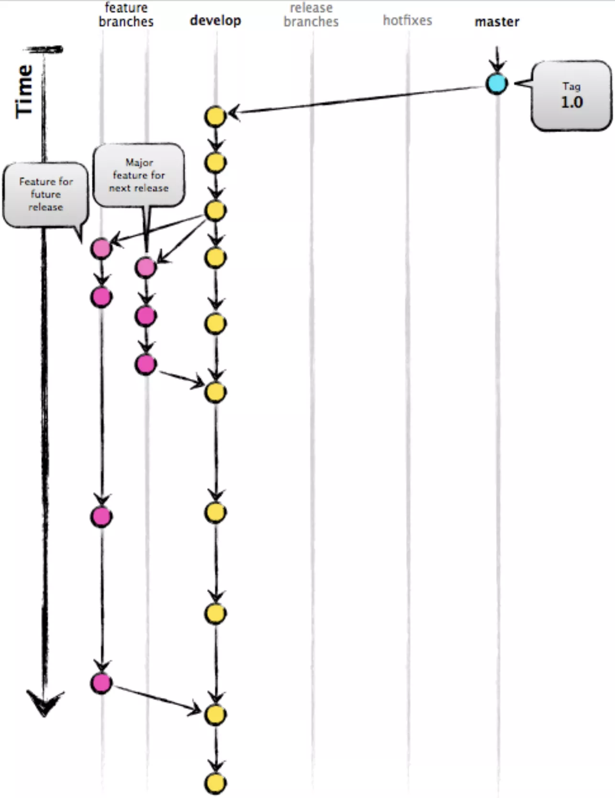
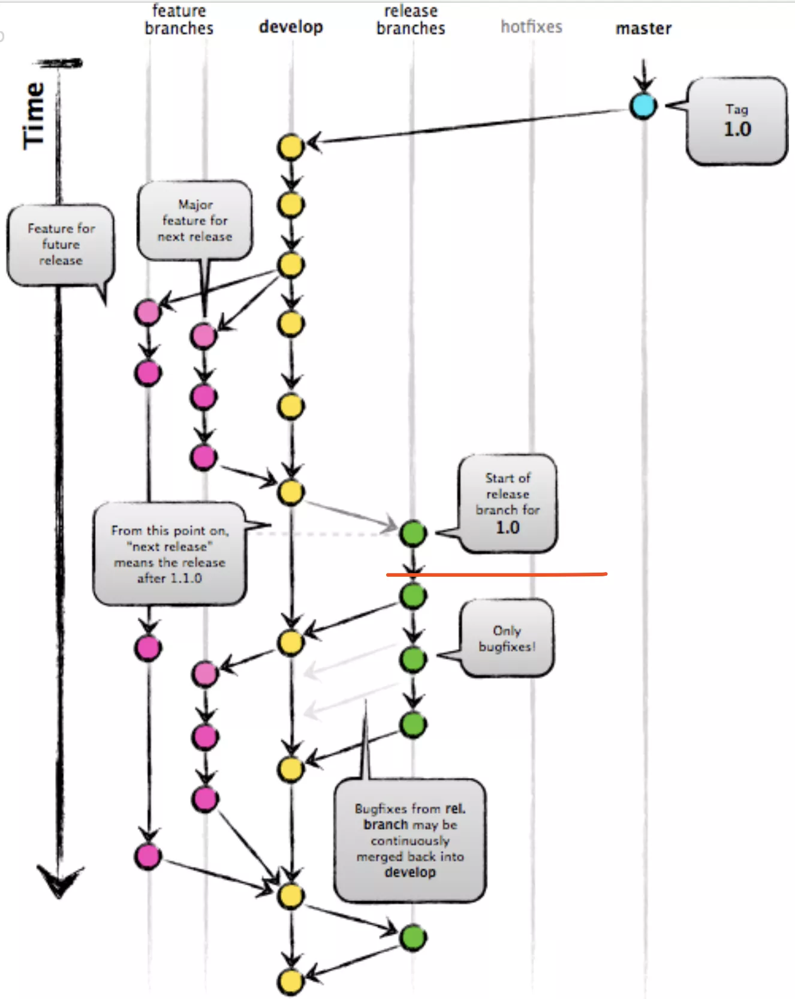
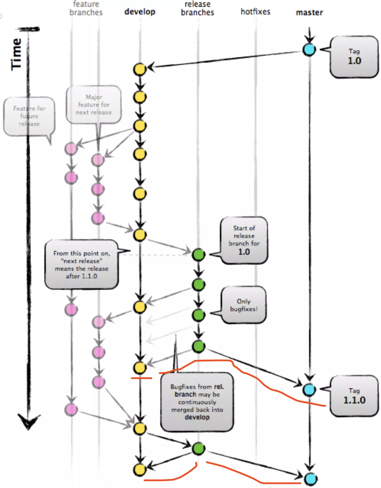
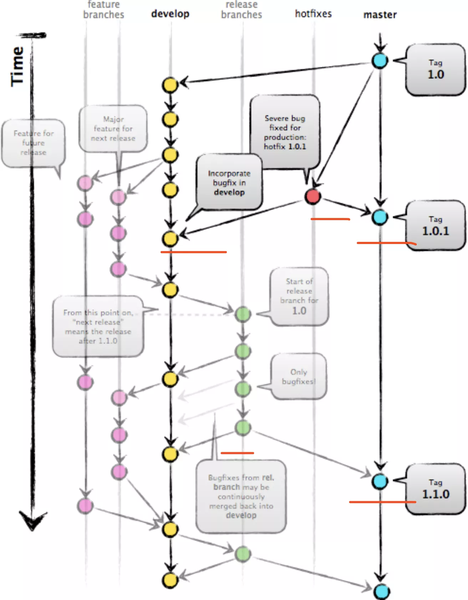

# gitflow工作流

## 一.分支名

|名称	| 说明    |
|:---|:---|
|master	| 主分支   |
|develop	| 主开发分支，包含确定即将发布的代码 |
|feature	| 新功能分支，一般一个新功能对应一个分支，对于功能的拆分需要比较合理，以避免一些后面不必要的代码冲突 |
|release	| 发布分支，发布时候用的分支，一般测试时候发现的 bug 在这个分支进行修复 |
|hotfix	hotfix | 分支，紧急修 bug 的时候用    |

## 二.流程

1 feature 分支都是从 develop 分支创建，完成后再合并到 develop 分支上，等待发布

2 当需要发布时，我们从 develop 分支创建一个 release 分支

然后这个 release 分支会发布到测试环境进行测试，如果发现问题就在这个分支直接进行修复。

在所有问题修复之前，我们会不停的重复 `发布->测试->修复->重新发布->重新测试` 这个流程

3 发布结束后，这个 release 分支会合并到 develop 和 master 分支，从而保证不会有代码丢失

master 分支只跟踪已经发布的代码，合并到 master 上的 commit 只能来自 release 分支和 hotfix 分支

4 hotfix 分支的作用是紧急修复一些 Bug

它们都是从 master 分支上的某个 tag 建立，修复结束后再合并到 develop 和 master 分支上

