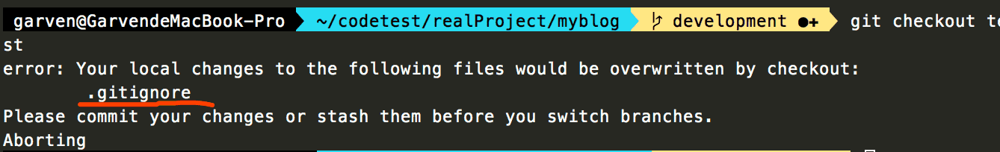

# 保存进度

若切换分支之前由于并没有完成本分支的任务, 或其他原因不想提交, 则切换分支时会有以下错误:



解决办法有两种:

1 提交, 然后切换到另一个分支, 完成工作后切换回来, 再reset会之前的状态

2 将工作成果放到暂存区中, 再切换

- git stash, 放进暂存区

- git status, 此时工作区是干净的

- git checkout test, 进行某些工作

- git checkout development, 切换回去

- git stash list, 查看暂存区情况

- git stash pop, 弹出暂存区中的首部, 即可恢复到原来一样

## 命令清单

```
## 保存进度
git stash

## 弹出进度
git stash pop

## 查看stash列表
git stash list

## 情况stash列表
git stash clear
```