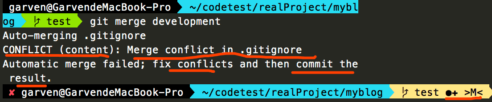
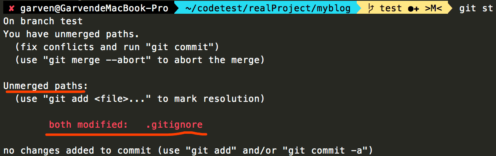
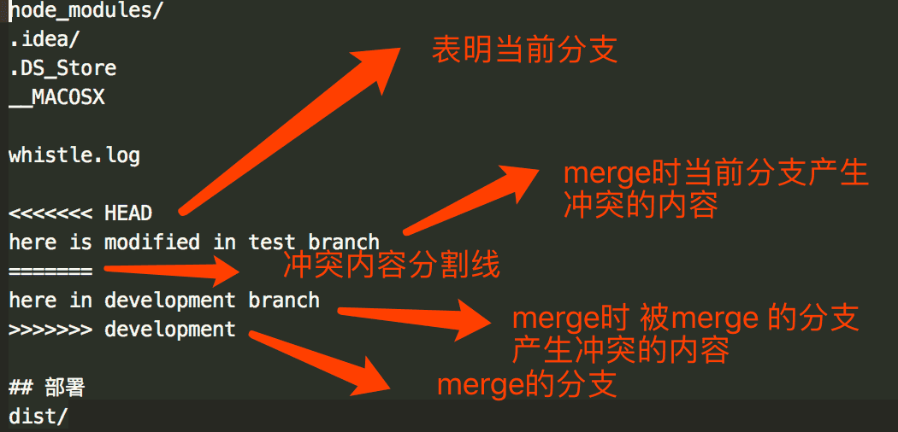
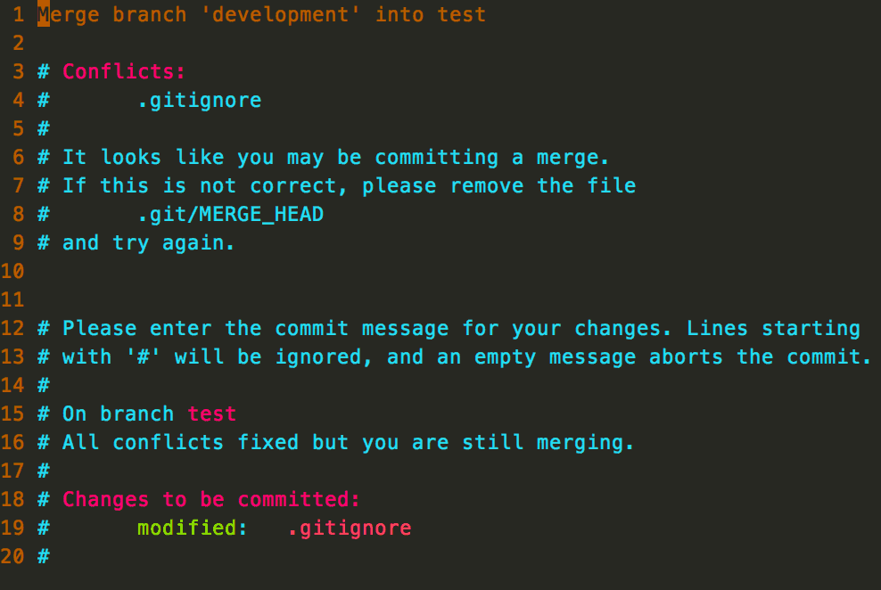
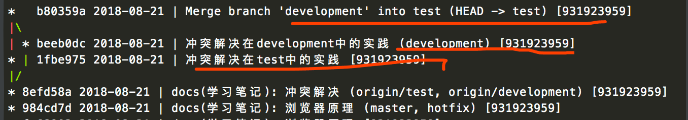

# 冲突解决

## 一.场景

1 在不同的分支上修改同一份文件

2 不同的人修改同一份文件

3 不同的仓库修改同一份文件

4 冲突只在分支合并时发生

## 二.注意事项

1 发生冲突并不可怕, 冲突的代码不会丢失

2 解决冲突, 重新提交, commit时不要给message

3 冲突信息的格式

## 三.实践

现在有 development 分支 和 test 分支, .gitignore文件相同内容

1 在development分支中对.gitignore做以下修改

```
node_modules/
.idea/
.DS_Store
__MACOSX

whistle.log

here in development branch

## 部署
dist/
```

2 提交版本

```
git add .
git commit -m"冲突解决在development中的实践"
```

3 切换到test分支

```
node_modules/
.idea/
.DS_Store
__MACOSX

whistle.log

here is modified in test branch

## 部署
dist/
```

4 提交

```
git add .
git commit -m"冲突解决在test中的实践"
```

5 合并development分支

```
git merge development
```



6 git status 查看状态



7 查看冲突, 去掉上下边界和分隔符, 取两个版本中的其一, 或者将两个版本的内容都删掉另外写内容



```
node_modules/
.idea/
.DS_Store
__MACOSX

whistle.log

## 部署
dist/
```

8 添加修改, 提交但不填写提交信息

```
git add .gitignore
git commit

:wq! Enter
```



10 查看记录验证

```
git history -10
```


