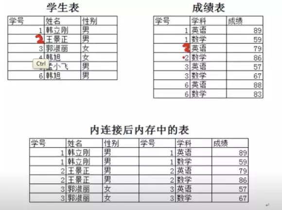
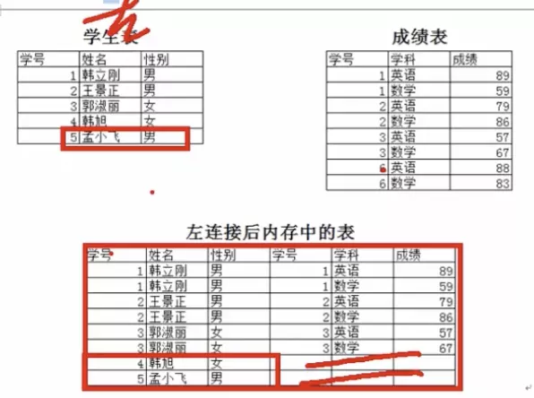
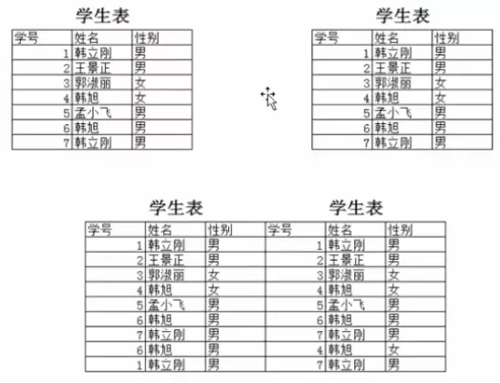

# 多表连接查询

## 一.内连接查询

内连接(INNER JOIN)使用比较运算符进行表间某些列数据的比较操作, 并列出这些表中与连接条件相匹配的数据航, 组合成新的记录

简而言之, **只有满足条件的记录才能出现在结果关系中**



```
SELECT A.*, B.* FROM TStudent A
    JOIN TScore B ON A.StudentID = B.StudentID
    [JOIN ... ON ...] 
```

TStudent A 表 连上 TScore B 表 且筛选条件为  A.StudentID = B.StudentID
再连上 xxxx 且筛选条件为 xxxx


## 二.外链接

返回到查询结果集合中不仅包含符合连接条件的行, 而且还包括左表(左外连接或左连接), 右表(右外连接或右连接)或两个边接表(全外连接)中所有数据行

### 2.1 左连接查询(JOIN LEFT)

左表即使不合符连接条件但也会全部出现在结果中



```
SELECT A.studendid, A.sanme, B.studentid FROM TScore A
    LEFT JOIN TScore B ON A.StudentID = B.StudentID
    [LEFT JOIN XXX ON XXX]
```

TScore A 表 先全部出现在结果表中, 然后筛选符合条件的TScore B 表放进结果表中对应位置上, 若空缺的部分则为NULL 

### 2.2 右连接查询

右表即使不合符连接条件但也会全部出现在结果中


## 三.自连接查询

自己连自己



```
SELECT A.studentid, A.sname FROM TStudent A
    JOIN TStudent B ON A.Sname = B.Sname WHERE A.studentid <> B.StudentID
```
