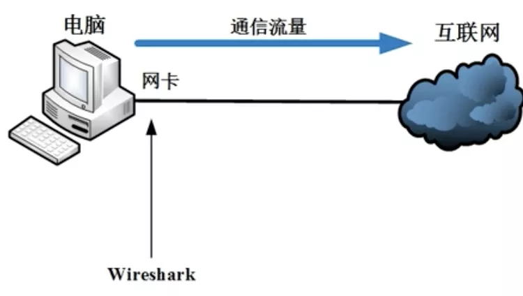
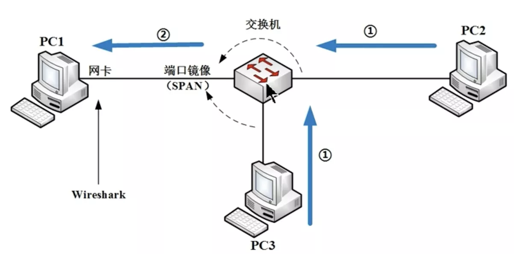

# 抓包原理

## 一.网络原理

### 1.1 本机环境

直接抓包本机网卡进出流量

### 1.2 集线器环境

流量泛洪, 同一冲突域

当PC2或PC3发包到集线器时, 由于 集线器 是物理层的产品, 当集线器接收到包时会往除了源端口以外的发包, 如PC1, 因此只要PC1装了wireshark, 则可以抓到包

但如今很少用, 太low

### 1.3 交换机环境

#### 端口镜像

因为交换机是链路层的产品, 会完全按照MAC地址表通信, 当PC2和PC3通信时很难有流量进入PC1

但可在交换机做SPAN技术, 即端口镜像, 把其它两个口的流量复制一份到PC1, PC1的网卡设为混杂模式, 即可抓包

#### ARP欺骗

#### MAC泛洪

---

## 二.底层原理