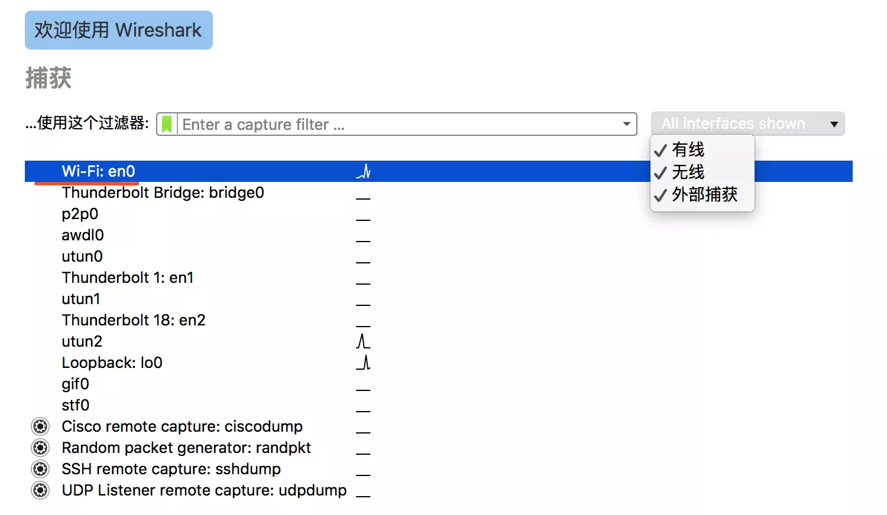
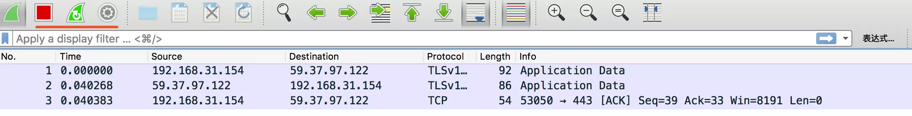
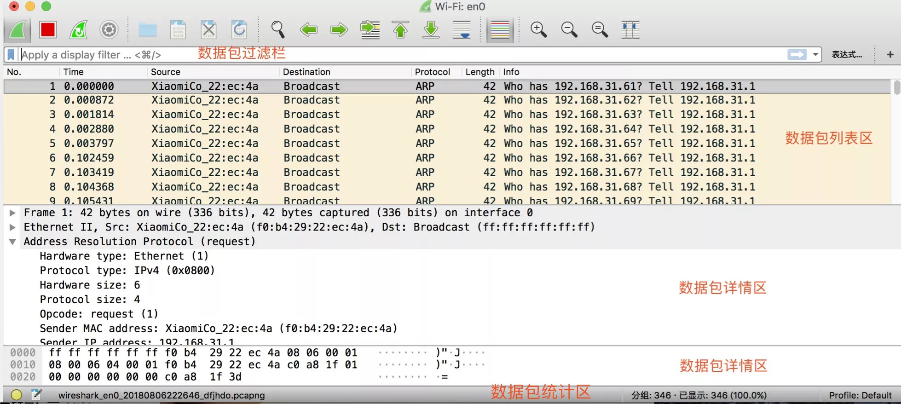

# 抓包基础

## 一.快速抓包

1 选择网卡:



2 打开准备抓包的页面, 然后双击选择的网卡, 进入抓包界面, 随着时间的推移会不断地抓包



3 按左上角红色按钮可停止抓包并选择保存格式

## 二.界面介绍



1 设置列: 列可以自定义设置

1.1 如需要查看每个包的TTL值, 则点击某个包, 在数据包详情区中点 Internet Protocol Version 4 , 然后右击 Time to live, 选择 应用为列 即可

1.2 如需重点关注Seq, 则可以在TCP中选择 Sequence number, 然后放入列中, 再重命名为 Seq 

2 时间格式: 可在视图中设置时间显示格式, 若要对比某个包与前面的某个包的相对延迟, 可以右键前面的按个包设置为参考

3 高亮某个数据包: 右键, 标记

## 三.过滤器设置

### 3.1 语法

1 类型Type: host / net / port

2 方向Dir: src / dst

3 协议Proto: ether / ip / tcp / udp / http / ftp

4 逻辑运算符: && || !

### 3.2 举例说明

```

src host 192.169.1.1 && dst port 80: 抓包源地址为 192.168.1.1 且 目的为 80 端口的流量

host 192.168.1.1 || host 192.168.1.2: 抓取 192.168.1.1 和 192.168.1.2 的流量

! broadcast: 不要抓取广播包

```