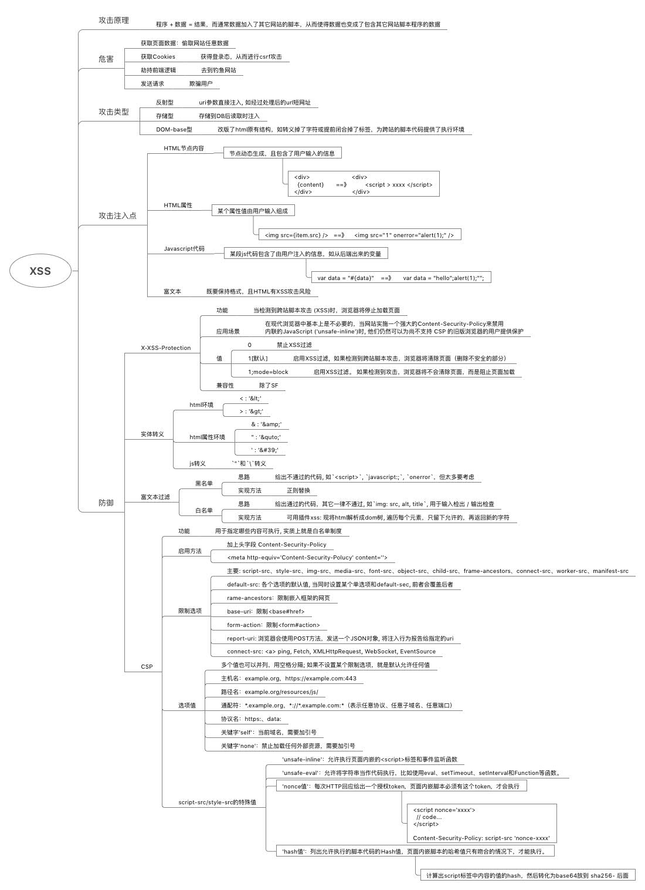

# XSS

> + [XSS](https://garvenzhang.github.io/2017/10/26/xss/)
> + [攻击过程](../../client/lib/xss.js)
> + [防御 - X-XSS-Protection](../../server/app-myblog.base.js)
> + [防御 - 转义](../../client/lib/xss.js)
> + [防御 - 富文本过滤](../../client/User/containers/Article/index.jsx)
> + [防御 - csp](../../server/middleware/csp.js)
> + [xmind](XSS.xmind)

