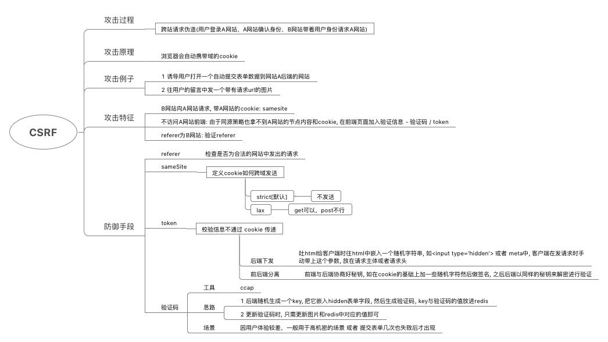

# CSRF

> + [CSRF](https://garvenzhang.github.io/2017/11/15/CSRF/)
> + [攻击过程](../../client/SSO/index.js)
> + [防御 - referer验证](../../server/middleware/referer.js)
> + [防御 - sameSite](../../server/controller/user.js)
> + [防御 - token](../../server/middleware/csrf_token.js)
> + [防御 - 验证码](../../server/middleware/captcha.js)
> + [xmind](CSRF.xmind)

