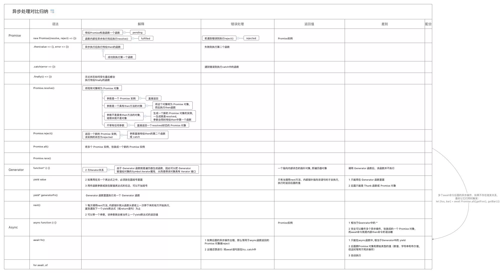

# 异步处理对比归纳

js是单线程, 一次只能处理一个任务, 任务的执行模式可分为 同步 和 异步

## 一.同步

1 定义: 后一个任务等待前一个任务结束，然后再执行，程序的执行顺序 与 任务的排列顺序是一致的、同步的

## 二.异步

1 定义: 每一个任务有一个或多个回调函数（callback），前一个任务结束后，不是执行后一个任务，而是执行回调函数，后一个任务则是不等前一个任务结束就执行，所以程序的执行顺序与任务的排列顺序是不一致的、异步的

## 三.回调

```
f1();
f2();
```

若`f1`很耗时, 则可改写为异步以避免假死状态

```
function f1(callback){

    setTimeout(function () {
    
        // f1的任务代码
        
        callback();
    
    }, 1000);

}
```

## 四.事件监听

1 思路: 采用事件驱动模式。任务的执行不取决于代码的顺序，而取决于某个事件是否发生

```
$btn.onclick = function () { xxx }
```

## 五.发布/订阅

1 思路: 存在一个"信号中心"，某个任务执行完成，就向信号中心"发布"（publish）一个信号，其他任务可以向信号中心"订阅"（subscribe）这个信号，从而知道什么时候自己可以开始执行

```
event.on('open', function () { xxx })
event.trigger('open')
```

## 六.Promise

1 目的: 为异步编程提供统一接口

2 思路: 每一个异步任务返回一个Promise对象，该对象有一个then方法，允许指定回调函数

```

function ajax (param) {
    return new Promise ((resolve, reject) => {
        
        if (xxx) {
            resolve(zz)
        } else {
            reject(error)
        }
        
    })
}

ajax({xxx})
    .then(value => {
    
    })
    .catch(error => {
    
    })

```

## 七.Generator

1 思路: Generator 函数是一个状态机, 封装了多个内部状态, 返回一个遍历器对象, 依次可遍历每个状态

```
function* helloWorldGenerator() {
  yield 'hello';
  yield 'world';
  return 'ending';
}

var hw = helloWorldGenerator();

hw.next()
// { value: 'hello', done: false }

hw.next()
// { value: 'world', done: false }

hw.next()
// { value: 'ending', done: true }

hw.next()
// { value: undefined, done: true }
```

## 八.Async

1 本质: Generator 函数的语法糖, 返回一个 Promise 对象，可以使用then方法添加回调函数。

```

const asyncReadFile = async function () {
  const f1 = await readFile('/etc/fstab');
  const f2 = await readFile('/etc/shells');
  console.log(f1.toString());
  console.log(f2.toString());
};

```

## Promise 与 Generator 与 Async

> [xmind](异步处理对比归纳.xmind)




