# git命令对比归纳

## 一.git仓库主要组成

Git 仓库有三个主要组成——工作目录，缓存区和提交历史

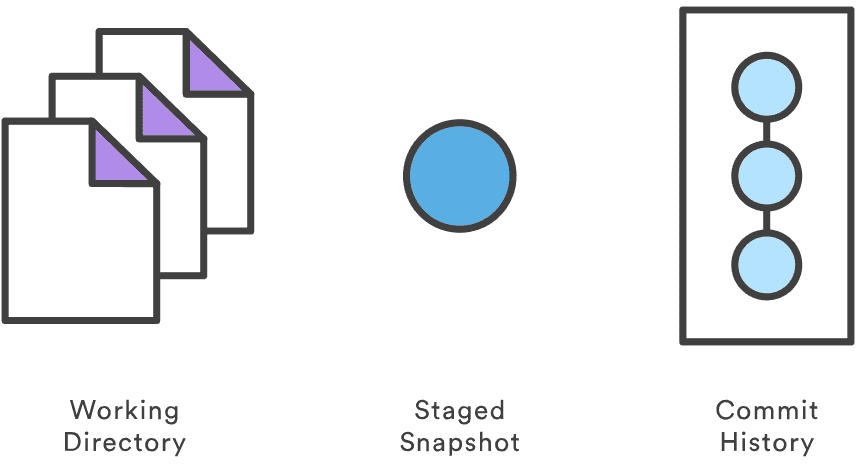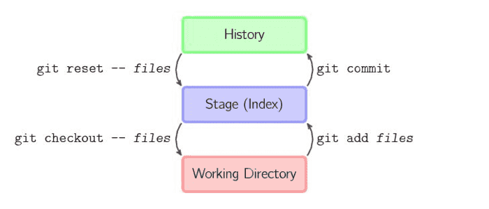

## 二.代码回滚 - 提交层面的操作

传给 git reset 和 git checkout 的参数决定了它们的作用域。如果你没有包含文件路径，这些操作对所有提交生效

### 2.1 git reset

reset 将一个分支的末端指向另一个提交

下面这两条命令让 hotfix 分支向后回退了两个提交

```
git checkout hotfix
git reset HEAD~2
```

hotfix 分支末端的两个提交现在变成了悬挂提交。也就是说，下次 Git 执行垃圾回收的时候，这两个提交会被删除。换句话说，如果你想扔掉这两个提交，你可以这么做

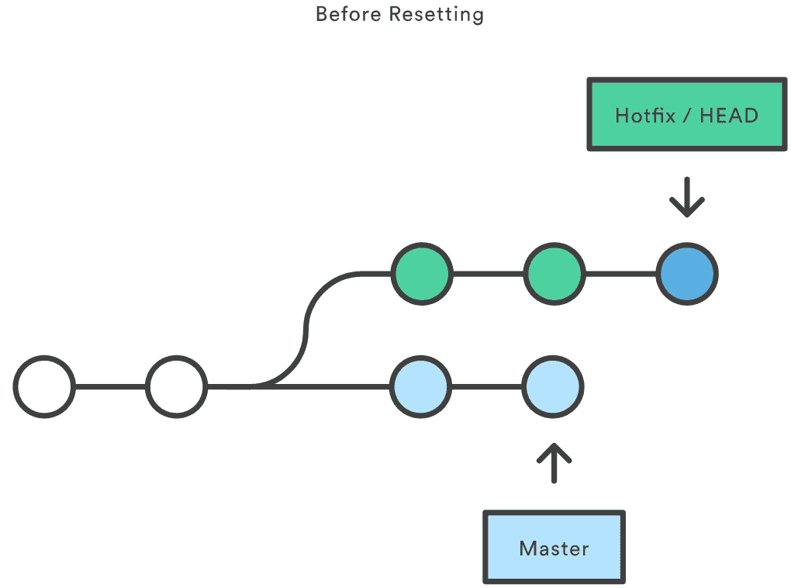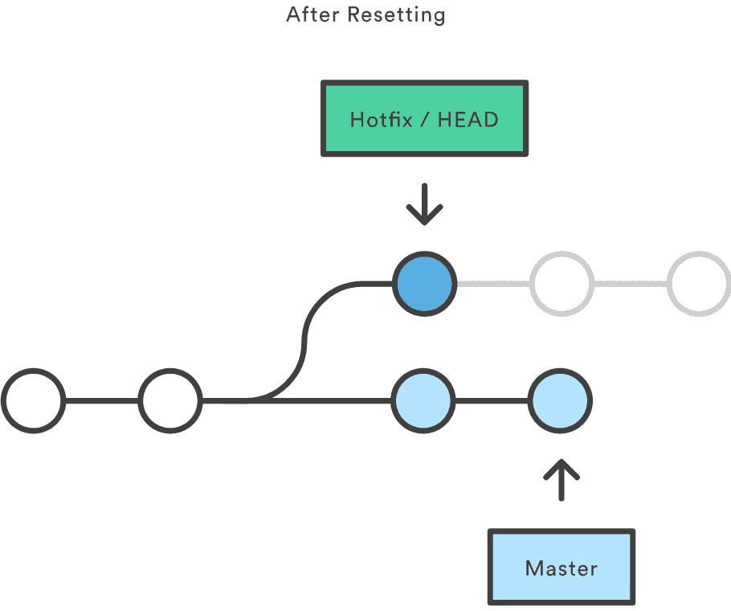

除了在当前分支上操作，你还可以通过传入这些标记来修改你的缓存区或工作目录:

```
--soft – 缓存区和工作目录都不会被改变
--mixed – 默认选项。缓存区和你指定的提交同步，但工作目录不受影响
--hard – 缓存区和工作目录都同步到你指定的提交
```

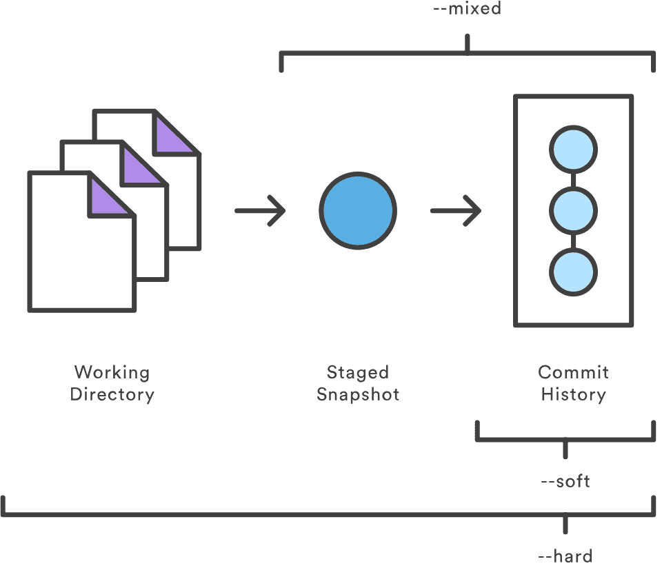

1 `git reset --mixed HEAD`: 将你当前的改动从缓存区中移除，但是这些改动还留在工作目录中

2 `git reset --hard HEAD`: 完全舍弃你没有提交的改动

### 2.2 git checkout

1 `git checkout hotfix`: 将HEAD移到一个新的分支，然后更新工作目录

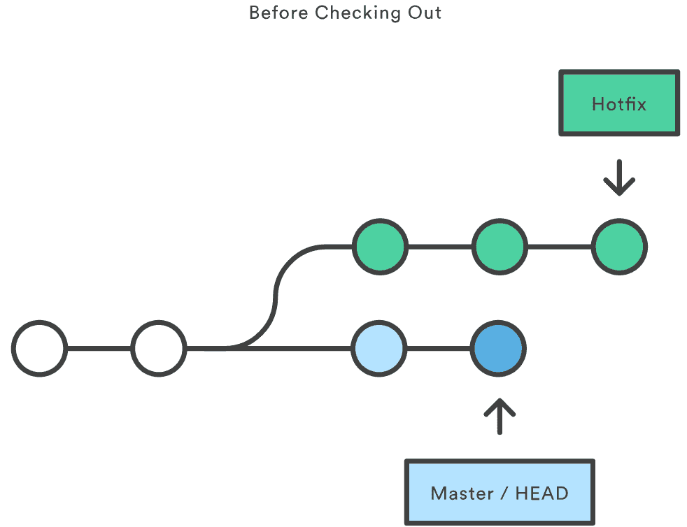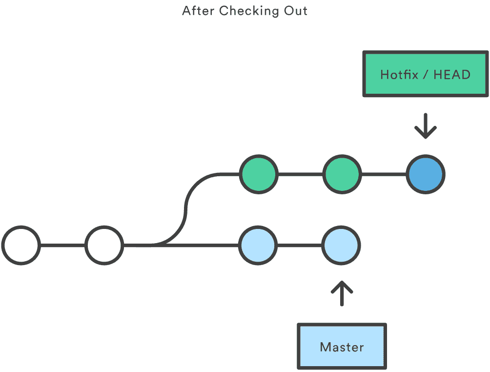

### 2.3 git revert

撤销一个提交的同时会创建一个新的提交

比如，下面的命令会找出倒数第二个提交，然后创建一个新的提交来撤销这些更改，然后把这个提交加入项目中

```
git checkout hotfix
git revert HEAD~2
```

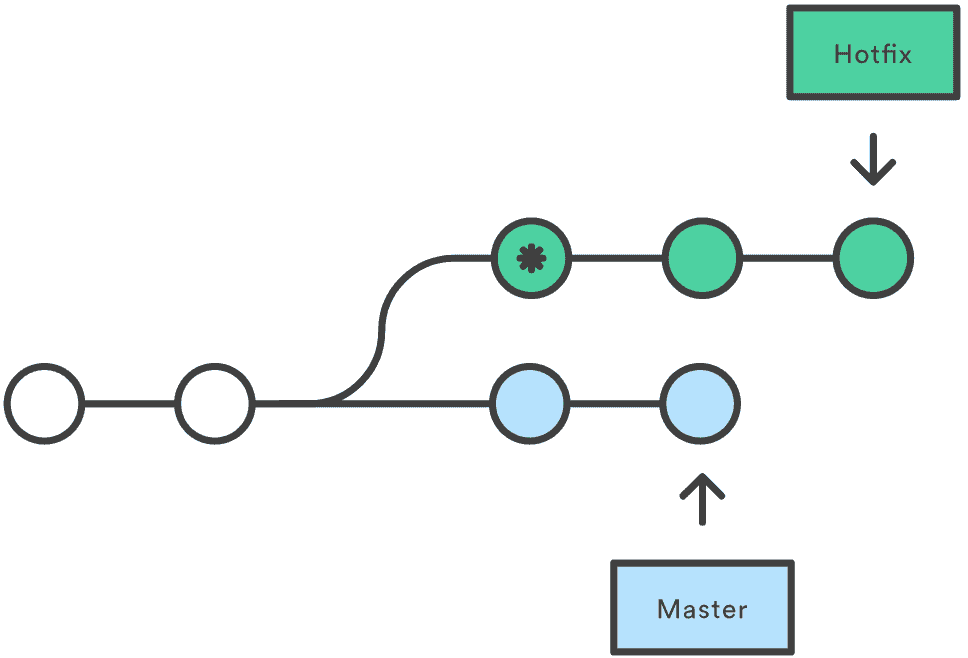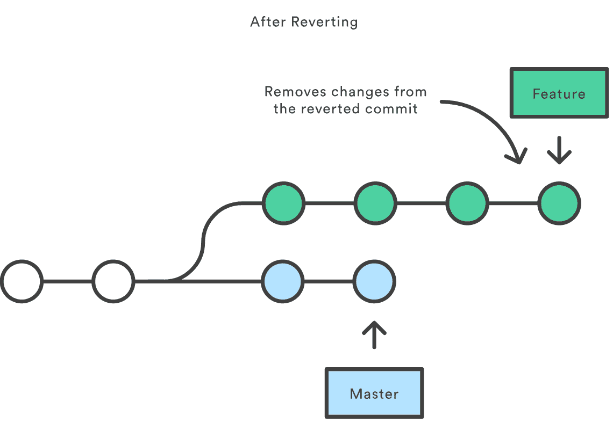

相比 git reset，它不会改变现在的提交历史。因此，git revert 可以用在公共分支上，git reset 应该用在私有分支上

你也可以把 git revert 当作撤销已经提交的更改，而 git reset HEAD 用来撤销没有提交的更改

就像 git checkout 一样，git revert 也有可能会重写文件。所以，Git 会在你执行 revert 之前要求你提交或者缓存你工作目录中的更改

## 三.代码回滚 - 文件层面的操作

### 3.1 git reset file

当检测到文件路径时，git reset 将缓存区同步到你指定的那个提交

如, 将倒数第二个提交中的 foo.py 加入到缓存区中，供下一个提交使用

```
git reset HEAD~2 foo.py
```

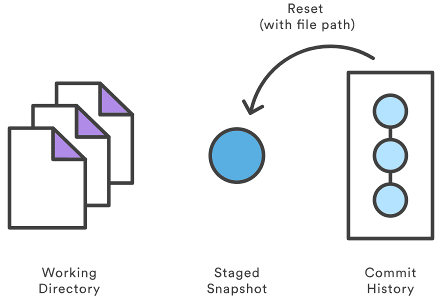

### 3.2 git checkout file

和带文件路径 git reset 非常像，除了它更改的是工作目录而不是缓存区

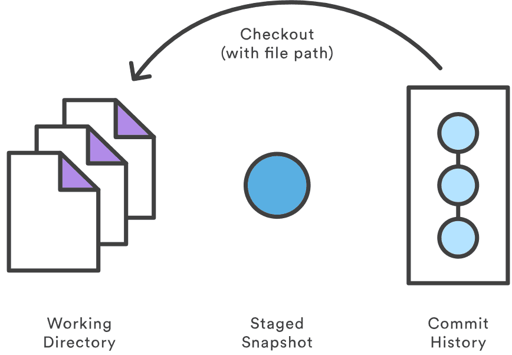

```
git checkout HEAD~2 foo.py
```

和提交层面相同的是，它可以用来检查项目的旧版本，但作用域被限制到了特定文件

## 四.reset与checkout与revert

命令	|   作用域	|   常用情景
:---|:---|:---
git |   reset	|   提交层面	在私有分支上舍弃一些没有提交的更改
git |   reset	|   文件层面	将文件从缓存区中移除
git |   checkout	|   提交层面	切换分支或查看旧版本
git |   checkout	|   文件层面	舍弃工作目录中的更改
git |   revert	|   提交层面	在公共分支上回滚更改
git |   revert	|   文件层面	（然而并没有）

---

## 五.代码合并

在一个feature分支进行新特性的开发，与此同时，master 分支的也有新的提交

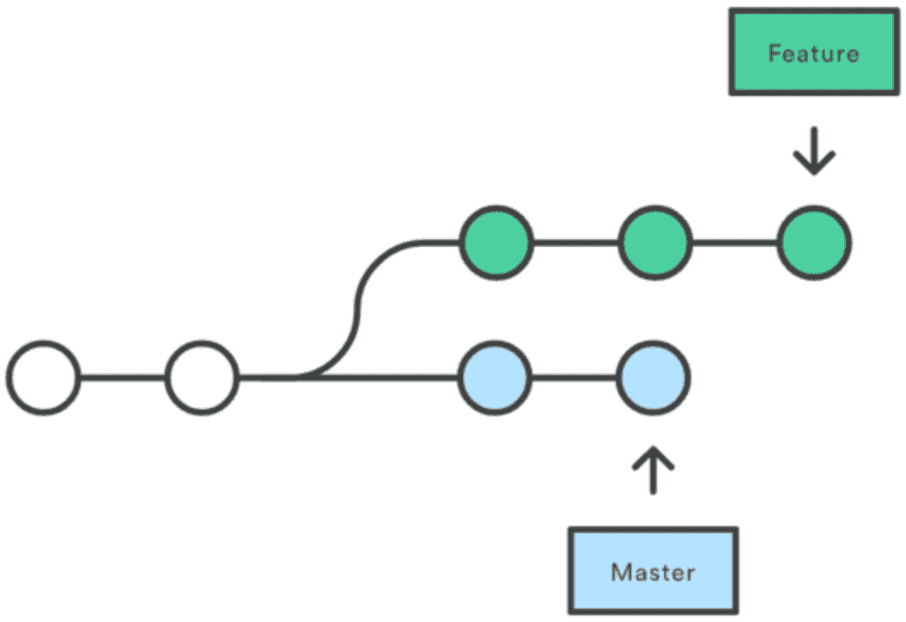

为了将master 上新的提交合并到你的feature分支上，你有两种选择：merging or rebasing

### 5.1 git merge

```
git checkout feature
git merge master

// or
git merge master feature
```

此时在feature上git 自动会产生一个新的commit(merge commit)

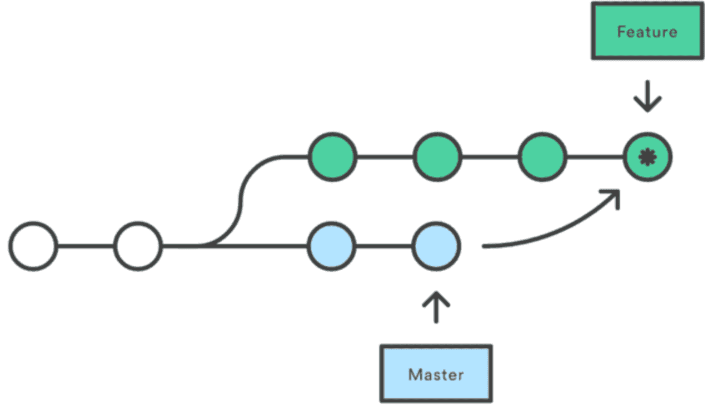

特点：自动创建一个新的commit

如果合并的时候遇到冲突，仅需要修改后重新commit

优点：记录了真实的commit情况，包括每个分支的详情

缺点：因为每次merge会自动产生一个merge commit，所以在使用一些git 的GUI tools，特别是commit比较频繁时，看到分支很杂乱

### 5.2 git rebase

```
git checkout feature
git rebase master
```

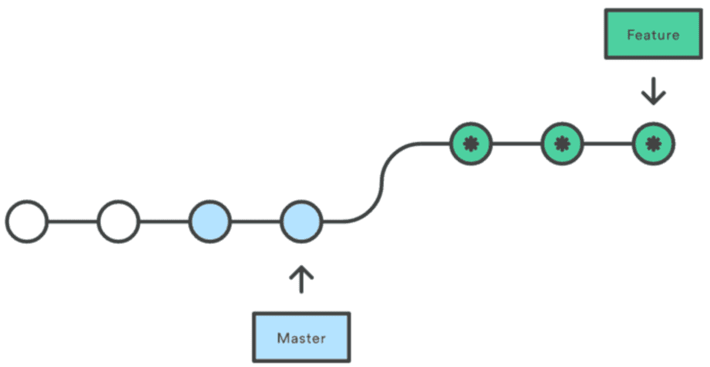

特点：会合并之前的commit历史

优点：得到更简洁的项目历史，去掉了merge commit

缺点：如果合并出现代码问题不容易定位，因为重写了history

**合并时如果出现冲突需要按照如下步骤解决**:

1 修改冲突部分

2 git add

3 git rebase --continue

4（如果第三步无效可以执行  git rebase --skip）

**黄金法则: 不要在公共分支上使用**:

rebase 将所有master的commit移动到你的feature 的顶端。问题是：其他人还在original master上开发，由于你使用了rebase移动了master，git 会认为你的主分支的历史与其他人的有分歧，会产生冲突

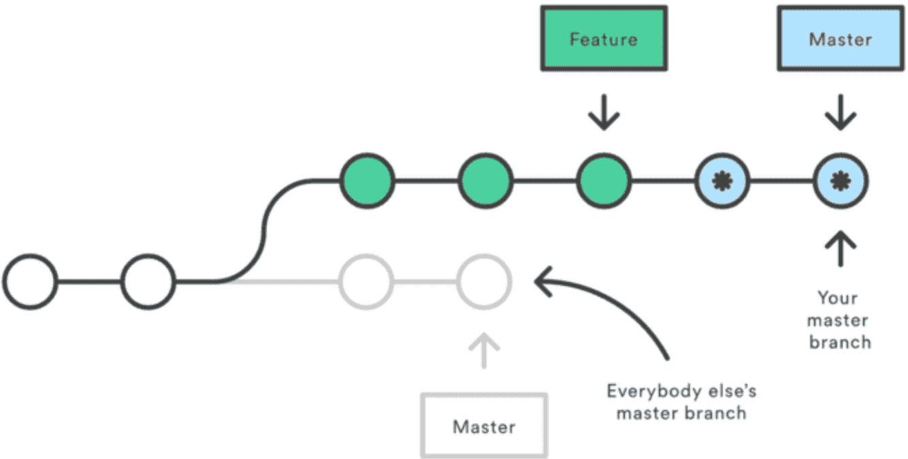

在执行git rebase 之前:

```
if (会有其他人看这个分支么) {
    不要采用这种带有破坏性的修改commit 历史的rebase命令
} else {
    随你便，可以使用rebase
}
```

## 六.merge与rebase

git rebase: 干净的，没有merge commit的线性历史树

git merge: 保留完整的历史记录，并且想要避免重写commit history的风险
