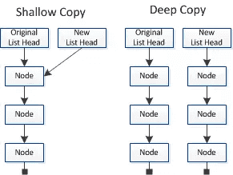
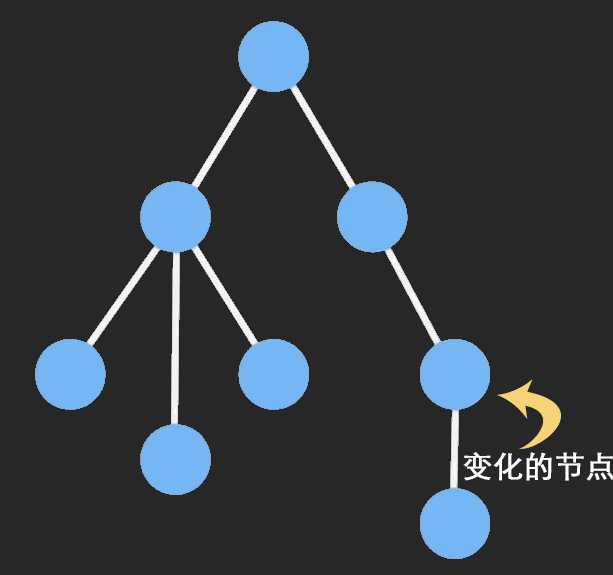

# 数据拷贝对比归纳

## 一.浅拷贝

1 只复制指向某个对象的指针，而不复制对象本身，新旧对象还是共享同一块内存

```
const obj = {a: 1}
const foo = obj
```

2 只简单地复制第一层

```
function shallowCopy (obj) {
  let _obj = {}
  for (var attr in obj) {
    _obj[attr] = obj[attr]
  }
  return _obj
}
```

## 二.Object.assign()

可以把任意多个的源对象自身的可枚举属性拷贝给目标对象，然后返回目标对象

进行的是**浅拷贝**，拷贝的是对象的属性的引用，而不是对象本身

## 三.深拷贝

### 3.1 转成 JSON 再转回来

缺点：若属性值中有undefined，则会转换失败

```
let obj1 = {
  a: 1,
  b: 2,
  c: 3
}

let obj2 = JSON.parse(JSON.stringify(obj1))
```

### 3.2 递归拷贝

之所以有深拷贝与浅拷贝，说到底还是因为基本类型和引用类型的缘故

思路: 遇到值为引用类型的，还是要以重复的方式去找到引用类型中的基本类型进行复制，因为只有基本类型的复制是互不相影响的

```
function deepCopy (target) {
  if (typeof target !== 'object') {
    return
  }

  let newObj = target instanceof Array ? [] : {}

  for (const prop in target) {
    if (target.hasOwnProperty(prop)) {
      newObj[prop] = typeof target[prop] === 'object' ? deepCopy(target[prop]) : target[prop]
    }
  }

  return newObj
}
```

## 四.浅拷贝与深拷贝

> + [学习笔记](https://garvenzhang.github.io/2018/01/21/deep-copy-and-shallow-copy/#%E5%8F%AA%E7%AE%80%E5%8D%95%E7%9A%84%E5%A4%8D%E5%88%B6%E7%AC%AC%E4%B8%80%E5%B1%82)



## 五.浅比较

> [源码笔记](https://github.com/GarvenZhang/blog-file/blob/some-stuff/package/react/src/addons/shallowEqual.js)

基本类型用全等比较, 引用类型之比较第一层

## 六.shouldComponentUpdate()

> [源码笔记](https://github.com/GarvenZhang/blog-file/blob/some-stuff/package/react/src/addons/ReactComponentWithPureRenderMixin.js)

进行的是浅比较

## 七.PureComponent

身是 PureRenderMixin ，和 Component 基本一样，只不过会在 render 之前帮组件自动执行一次shallowEqual（浅比较），来决定是否更新组件

使用 PureComponent 相当于省去了写 shouldComponentUpdate 函数，当组件更新时，如果组件的 props 和 state：

1 引用和第一层数据都没发生改变，render 方法就不会触发，这是我们需要达到的效果
 
2 虽然第一层数据没变，但引用变了，就会造成虚拟 DOM 计算的浪费

3 第一层数据改变，但引用没变，会造成不渲染，所以需要很小心的操作数据

## 八.immutableJs

### 8.1 特点

1 持久性数据结构: 持久性数据结构保证数据一旦创建就不能修改，使用旧数据创建新数据时，旧数据也不会改变，不会像原生 js 那样新数据的操作会影响旧数据

2 结构共享: 没有改变的数据共用一个引用，这样既减少了深拷贝的性能消耗，也减少了内存



如果对象树中一个节点发生变化，只修改这个节点和受它影响的父节点，其它节点则进行共享

### 8.2 优点

1 降低了 Mutable 带来的复杂度: 数据可回溯

2 节省内存: 相对于深拷贝

3 Undo/Redo，Copy/Paste，甚至时间旅行: 每次数据都是不一样的，只要把这些数据放到一个数组里储存起来，想回退到哪里就拿出对应数据即可，很容易开发出撤销重做这种功能

4 函数式编程: 只要输入一致，输出必然一致

### 8.3 缺点

1 学习成本

2 增加了资源大小(库源文件大)

3 容易与原生对象混淆: api的用法

4 对旧项目造成较大的破坏

## 九.Object.freeza

冻结一个对象, 如 var obj = Object.freeze({bar: {}}) 后, obj对象无法添加新属性等操作但 obj.bar 可以

## 十.const

对于简单类型值就是比那辆指向的那个内存地址, 因此等同于常量; 对于复合类型, 变量指向的内存地址保存的是一个指向实际数据的指针, const只保证这个指针时固定的, 即 const obj = {}; obj = {} 会报错, 至于指向的数据结构是否可变不能控制


