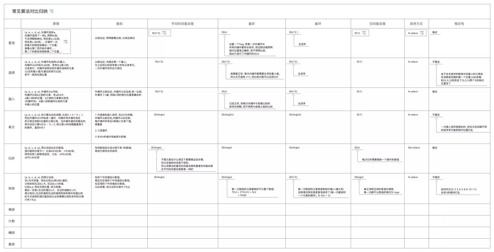

# 常见排序算法对比归纳

+ [xmind](常见算法对比归纳.xmind)
+ [学习笔记 - 动画](https://www.cnblogs.com/Garven/articles/6790223.html)
+ [复杂度分析](../../client/Admin/containers/GeneralCatalogue/sort.js)
+ **冒泡排序**:
  [JS版](../../client/Admin/containers/GeneralCatalogue/bubbleSort.js)
+ **选择排序**:
  [JS版](../../client/Admin/containers/GeneralCatalogue/selectSort.js) /
  [C版](https://github.com/GarvenZhang/C-study-note/tree/master/100.1selection_sort/main.c)
+ **插入排序**:
  [JS版](../../client/Admin/containers/GeneralCatalogue/insertionSort.js) /
  [C版](https://github.com/GarvenZhang/C-study-note/tree/master/100.2insertion_sort/main.c)
+ **排序**:
  [快速排序](../../client/Admin/containers/GeneralCatalogue/quickSort.js) /
  [归并排序](../../client/Admin/containers/GeneralCatalogue/mergeSort.js) /
  [希尔排序](../../client/Admin/containers/GeneralCatalogue/shellSort.js)

