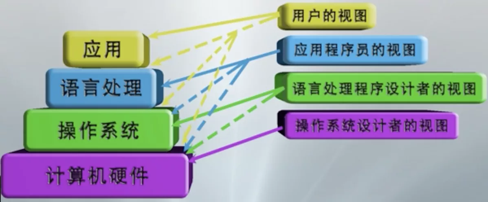

# 计算机系统概览

## 一.计算机系统的组成

计算机系统: 包括硬件则系统和软件子系统

硬件: 借助光, 磁, 电, 机械等原理构成的各种物理部件的有机组合，是系统工作的实体，如cpu, 主存储器, I/O控制系统，外设

软件； 各种程序和文件, 用于指挥计算机系统按指定的要求进行协同工作, 包括 系统软件, 支撑软件, 和应用软件

关键系统软件: 操作系统 和 语言处理系统

## 二.计算机系统的用户视图

