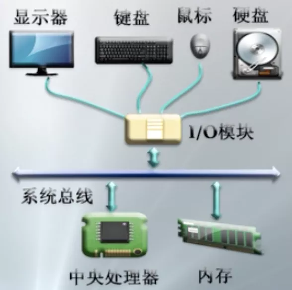
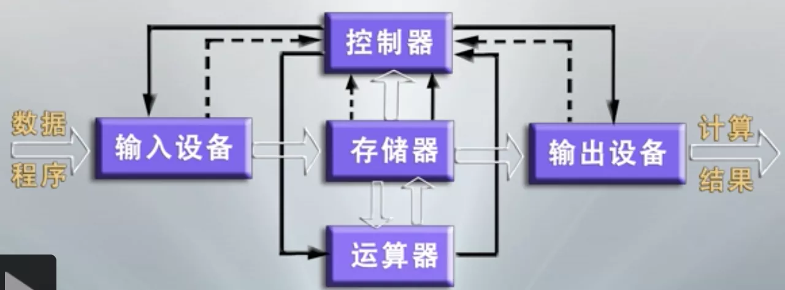
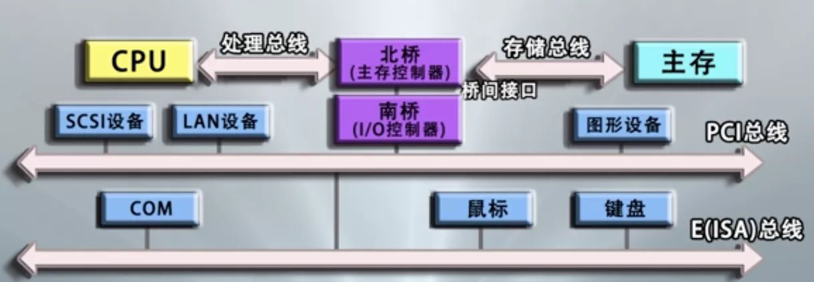
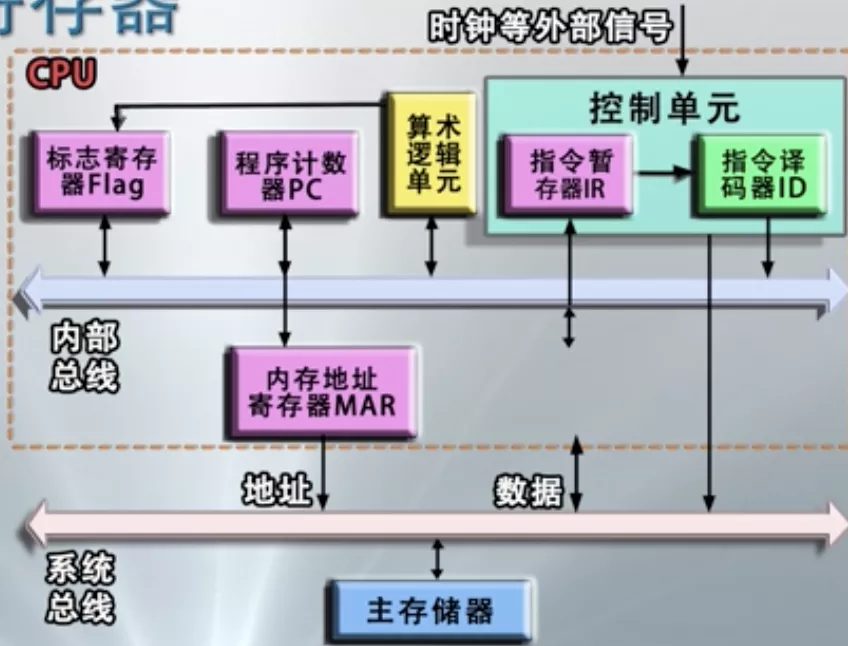
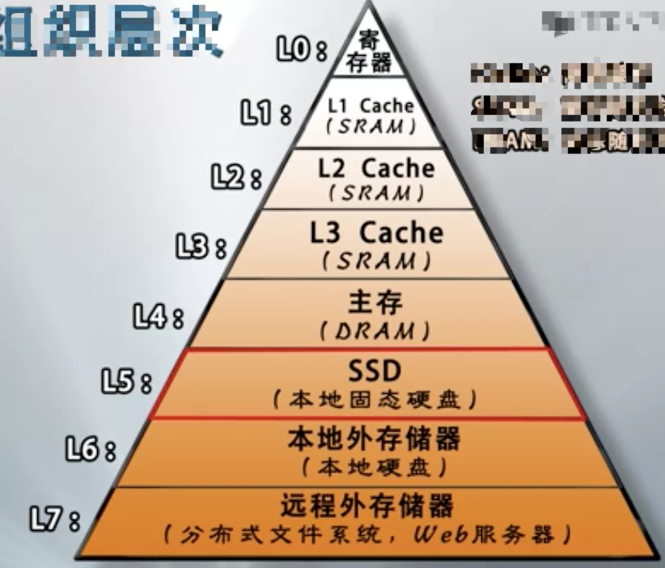

# 计算机硬件系统

## 一.计算机硬件系统的组成

中央处理器: 运算单元(用于执行具体机器指令的运算), 控制单元(解译机器指令)

主存储器: 用于存储正在执行的程序和数据

外围设备: 输入设备/输出设备/存储设备/网络通信设备

总线

## 二.存储程序计算机(冯诺依曼计算机模型)

### 2.1 主要特点

1 以运算单元为中心, 控制流由指令流产生

2 采用存储程序原理, 面向主存组织数据流

3 主存是按地址访问，线性编址的空间

4 指令由 操作码 和 地址码 组成

5 数据以二进制编码

### 2.2 总线及其组成

1 总线是计算机各种功能部件之间传送信息的公共通信干线, 是CPU, 内存, 输入输出设备传递信息的公用通道

2 计算机的各个部件通过总线相连接, 外设通过相应的接口电路再与总线相连接, 从而形成了计算机硬件系统

3 按照所传输的信息种类, 总线包括一组控制线、一组数据线、一组地址线

#### 总线的类型

内部总线: 用于CPU芯片内部连接各元件

系统总线: 用于连接CPU, 存储器和各种I/O模块等主要部件

通信总线: 用于计算机系统之间通信

### 2.3 中央处理器(CPU)

计算机运算核心和控制单元

#### 包括

1 运算逻辑部件: 一个或多个运算器

2 寄存器部件: 包括通用寄存器, 控制与状态寄存器, 以及高速缓冲存储器

3 控制部件:

3.1 实现各部件间联系的数据, 控制及状态的内部总线

3.2 负责对指令译码, 发出为完成每条指令所要执行操作的可控制信号, 实现数据传输等功能的部件

#### 处理器与寄存器

#### 存储器的组织层次

Cache: 高速缓存

SRAM: 静态随机存储器

DRAM: 动态随机存储器

L0 <------------------------------------------------------------------------------> L7

容量更小, 速度更快, 价格更高(单位: 字节)                        容量更大, 速度更慢, 价格更低(单位: 字节)

### 2.4 外设及其控制

设备类型: 输入设备、输出设备、存储设备、机机通信设备

设备控制方式:

1 轮询方式: CPU忙式控制, CPU执行内存数据交换

2 中断方式: CPU启动外设, 外设中断CPU, CPU执行内存数据交换

3 DMA方式: CPU启动DMA, DMA执行输入输出与内存数据交换, DMA中断CPU

 
