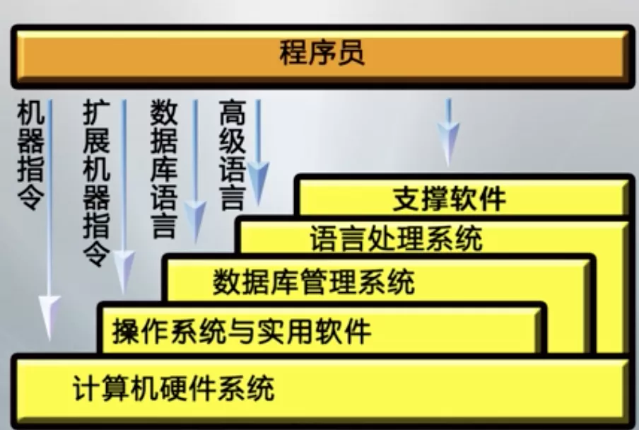
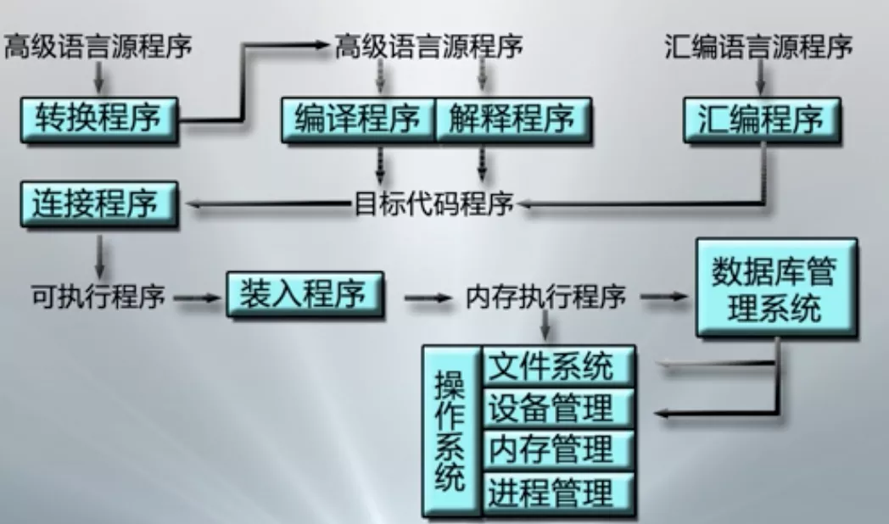

# 计算机软件系统

## 一.计算机软件系统的组成

**系统软件:**

1 操作系统: 实施对各种软硬件资源的管理控制

2 实用程序: 为方便用户所设, 如文本编辑等

3 语言处理程序: 把用 汇编语言/高级语言编写的程序 翻译成可执行的机器语言程序 

**支撑软件:**

有接口软件, 工具软件, 环境数据库, 支持用户使用计算机的环境, 提供开发工具, 也可认为是系统软件的一部分

**应用软件:** 是用户按其需求自行编写的专用程序

## 二.程序员的计算机系统视图

**软件开发的不同层次:**

1 计算机硬件系统: 机器语言

2 操作系统之资源管理: 机器语言 + 广义指令(扩充了硬件资源管理)

3 操作系统值文件系统: 机器语言 + 系统调用(扩充了信息资源管理)

4 数据库管理系统: ++数据库语言

5 语言处理程序: 面向问题的原因

## 三.计算机程序的执行过程

