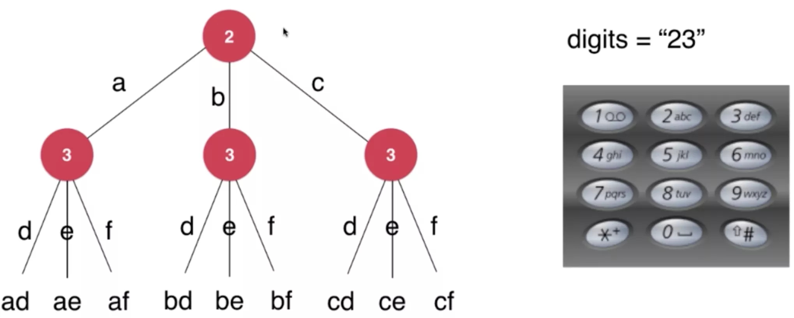

# 树形问题:

1 **回溯法**: 递归调用的一个重要特征, 即沿着一条路径去寻找答案, 到底后需要返回上一层, 再去寻找其它路径

1.1 时间复杂度: O(2^n)

1.2 特点: 是暴力解决法的一个主要实现手段

1.3 应用场景:

---

1 题目: 对于手机键盘上的9个数字键, 给出一个数字字符串, 返回这个数字字符串能表示的所有字母组合:

2 思路:

2.1 先想清楚边界问题:

字符串的合法性: 如 1, 0, *, # 是没有字符的

空字符串

多个解的顺序

2.2 把所有情况用树形结构列出来



digits 是数字字符串

s(digits) 是 digits 所能代表的字母字符串

```
s(digits[0, ..., n-1])
  = letter(digits[0]) + s(digits[1...n-1])
  = letter(digits[0]) + letter(digits[1]) + s(digits[2...n-1])
  = ...
```

