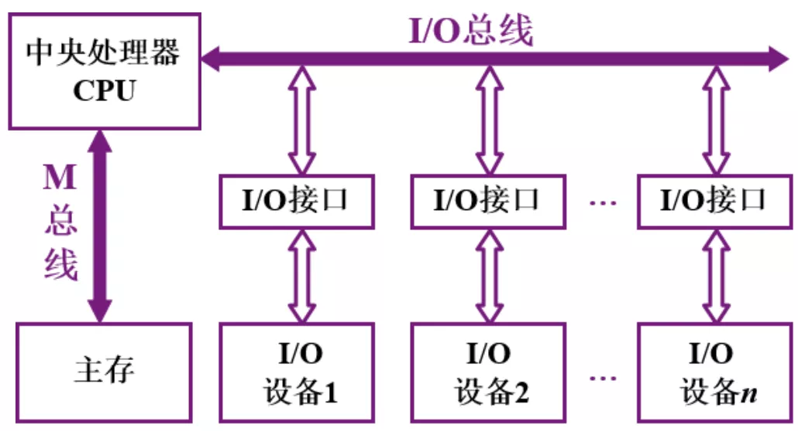
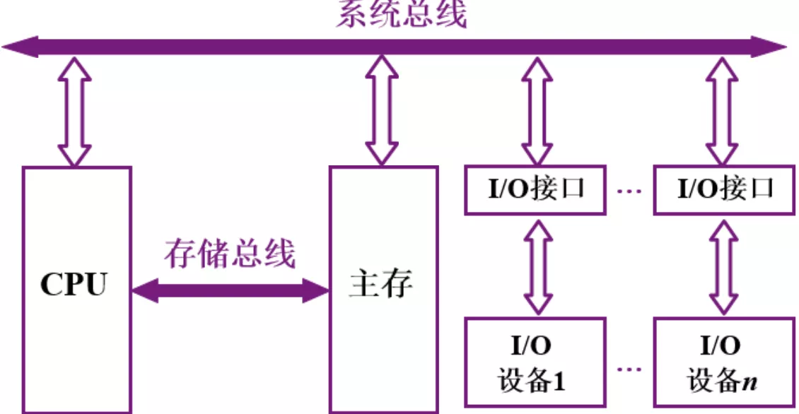
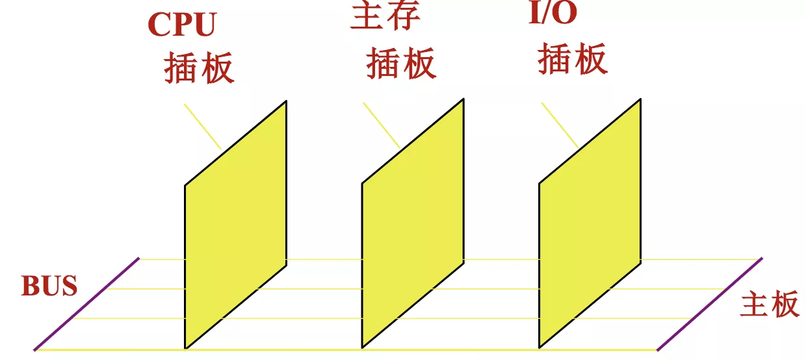
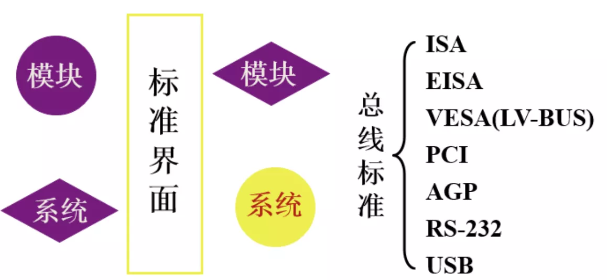

# 总线的基本概念及分类

## 一.什么是总线

连接各个部件的信息传输线, 是 各个部件共享的传输介质

## 二.总线上信息的传送

串行(只有一条物理信道, 以 位 为单位传输, 较慢, 适合远距离传输): --------

并行(同时可以传多个, 较快): --------
                         --------
                         --------
                         
## 三.单总线结构框图     

缺点: 数据量非常大的时候总线会很繁忙, 总线成了系统性能的瓶颈

## 四.面向CPU的双总线结构框图

    

缺点: CPU称为了 主存 与 I/O 之间的主要传输通道, 但CPU主要是用于计算

## 五.以存储器为中心的双总线结构框图

---

## 六.总线分类

1 片内总线: 芯片内部的总线

2 系统总线: 计算机各部件之间的信息传输线

2.1 数据总线： 双向, 与机器字长, 存储字长有关

2.2 地址总线: 单向, 与存储地址, I/O地址有关

2.3 控制总线: 有出 有入

3 通讯总线: 用于 计算机系统之间 或 计算机系统与其它系统(如控制仪表, 移动通信等)之间的通信, 也可为为 串行通信总线 和 并行通信总线

---

## 七.总线特性及性能指标

### 7.1 总线特征

1 机械特性: 尺寸、形状、管脚数、排列顺序

2 电器特征: 传输方向 和 有效的电平范围

3 功能特性: 每根传输线的功能(地址，数据，控制)

4 时间特性: 信号的时序关系

### 7.2 性能指标

1 总线宽度: 数据线的根数

2 标准传输率: 每秒传输的最大字节数(MBps)

3 时钟同步/异步: 同步、异步

4 总线复用: 地址线 与 数据线 复用

5 信号线数: 地址线、数据线和控制线的总和

6 总线控制方式: 突发、自动、仲裁、逻辑、计数

7 其它指标: 负载能力

### 7.3 总线标准

