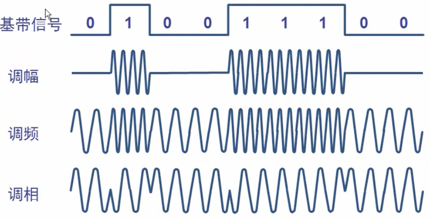

# 数据通信基础知识

## 一.典型的数据通信模型

```

    <------------------------------------------ 数据通信系统 ------------------------------------->
                --  --                 /\  /\                      /\  /\                    --  --      
               _| |_| |_           -/\/  \/  \/-               -/\/  \/  \/-                _| |_| |_
     输入汉字   数字比特流               模拟信号                     模拟信号                   数字比特流     显示汉字      
       PC机  ------------> 调制解调器 ------------>    公用电话网   ----------->  调制解调器   ------------>    PC机   
                                                 |               |                                                        
    <-------------------- 源系统 -----------------|   传输系统     |-------------- 目的系统 ------------------->
                                                 |               |                                                  
      输入信息         输入数据         发送的信    |               | 接收的信号           输出数据          输出信息                                               
    ----------> 源点 ---------> 发送器 -----------|---- 传输系统 --|---------->  接收器 ---------->  终点 ------->                                                                                                              
                                                                                                                        
```

数字信号(数字比特流): 离散，比如有电、没电、有电、没电……  或者 -5V、+5V、-5V、+5V 等

模拟信号：连续，比如正弦波、余弦波、正弦波、余弦波 等

```

             0 1 0 1 0 1 0 1 0      
              --  --  --  --
    A计算机   _| |_| |_| |_| |_ ------------------------------------------ 计算机B
             ^ ^ ^
             | | | ……
    一个波形就是一个码元  
              
```

在数字通信中常常用时间间隔相同的符号来表示一个二进制数字，这样的事件间隔内的信号称为`二进制码元`, 而这个间隔称为码元长度, 1码元可携带nbit的信息量

---

## 二.信道

信道: 一般表示向一个方向传送信息的媒体

单向通信(单工通信): 只能有一个方向的通信

双向交替通信(半双工通信): 通信的双方都可以发送信息，但不能双方同时发送(也不能同时接受)

双向同时通信(全双工通信): 通信的双方可以同时发送和接收信息

基带信号(基本频带信号): 来自信源的信号

带通信号: 把基带信号经过载波调制后，把信号的频率范围版移到较高的频段以便在信道中传输

在传输距离较近时都采用基带传输, 比如计算机到打印机等外设的信号；而较远时则通过带通信号，到达目的地后再转成基带信号

### 对基带数字信号的调制方法



### 常用编码

```

                                                                                                    
                                                                                                    
                                                                                                    
                                                                                                    
                                                                                                    
                                                                                                    
                                                                                                    
                                                                                                    
                                                                                                    
                                                                                                    
                                                                                                    
                                                                                                    
                                                                                                    
                                                                                                    
                                                                                                    
                                                                                                    
                                                                                                    
                                                                                                    
                                                                                                    
                                                                                                    
                                                                                                    
                                                                                                    
                                                                                                    
                                                                                                    
                                                                                                    
                                                                                                    
                                                                                                    
                                                                                                    
                                                                                                    
                                                                                                    

```

