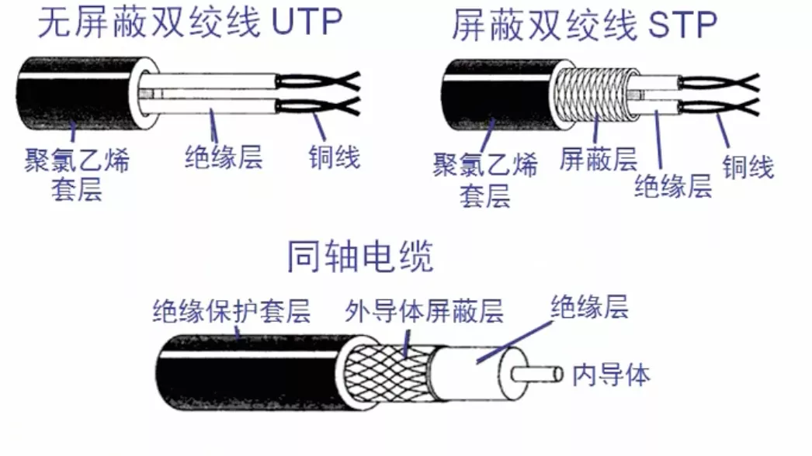
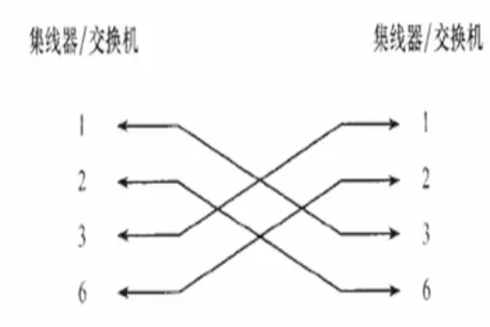
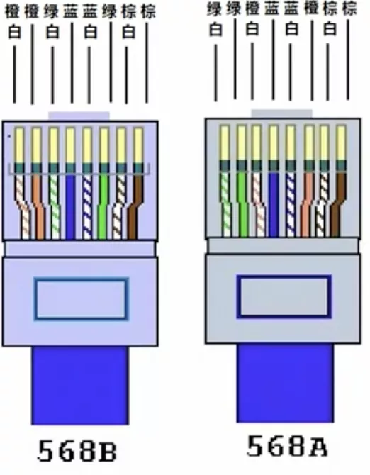
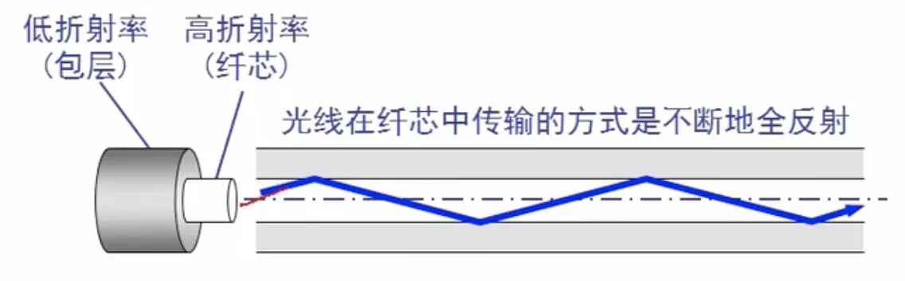
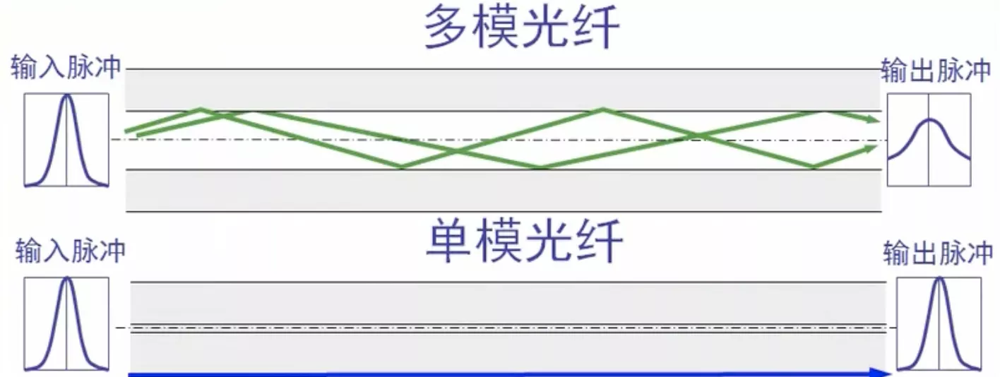

# 传输介质

## 一.导向传输媒体

导向传输媒体中，电磁波沿着固定媒体传播

双绞线: 屏蔽双绞线STP、无屏蔽双绞线UTP

同轴电缆:

50Ω同轴电缆: 用于数字传输，多用于基带传输也叫基带同轴电缆

75Ω同轴电缆: 用于模拟传输，即带宽同轴电缆

### 1.1 网线

**直通线**:

1 顺序: 双绞线夹线顺序两边一致，为 白橙 -> 橙 -> 白绿 -> 蓝 -> 白蓝 -> 绿 -> 白棕 -> 棕

2 应用: 不同类设备相连接

主机/路由器 到 交换机/集线器

**交叉线**:

 

1 应用: 同类设备相连接

主机 到 主机

集线器 到 集线器

交换机 到 交换机

集线器 到 交换机

路由器 直连 主机

*以前会有线序的问题，现在的网卡会自动识别，现在错误的线序也可以*

### 1.2 光纤

**传输原理**:

**种类**:

单模光纤: 只传输一种电磁波模式，直径细，不折射，传播特性好，多用于有线电视

多模光纤: 可传输多种电磁波模式，直径粗

## 二.非导向传输媒体

指自由空间, 电磁波传输称为 无线传输

短波通信: 靠电离层的反射, 信道的通信质量较差

微波通信: 在空间中直线传播，如地面微波接力通信，卫星通信

---

## 三.集线器

工作特点: 在网络中只起到 信号放大 和 重发作用，其目的是 扩大网络 的传输范围，不具备信号的定向传送能力

最大传输距离：100m

缺点: 易冲突
