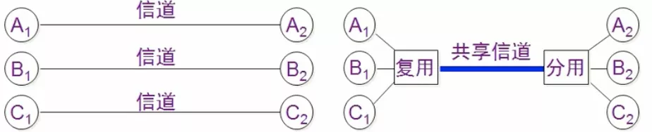
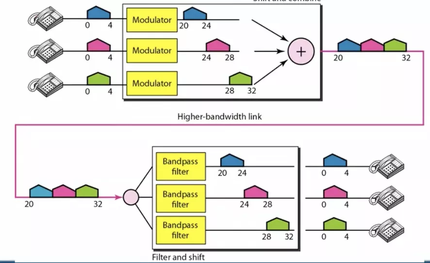
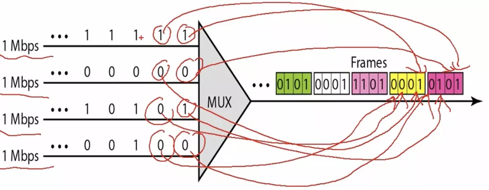
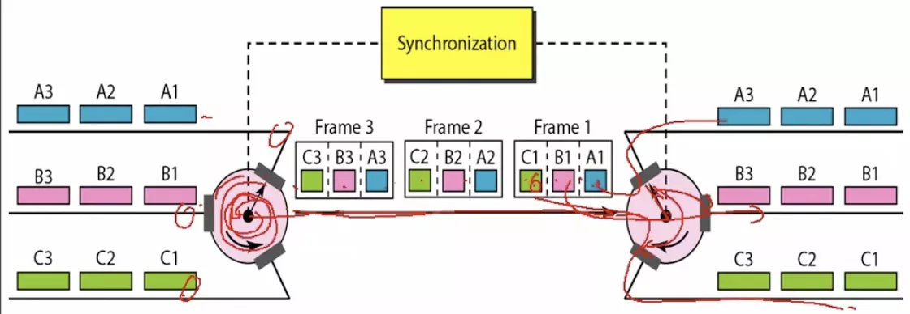
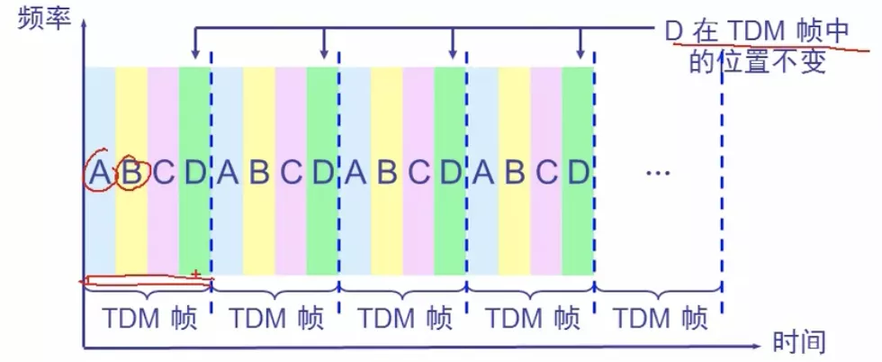
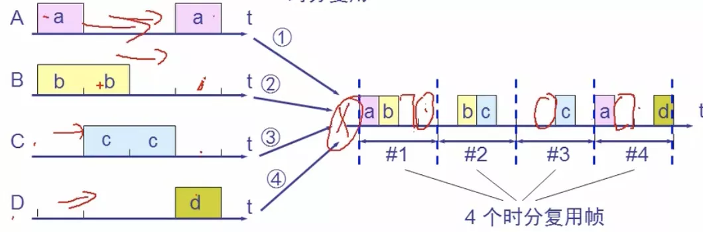
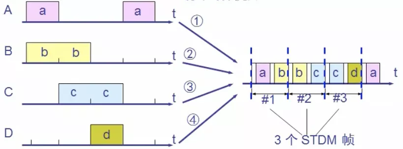
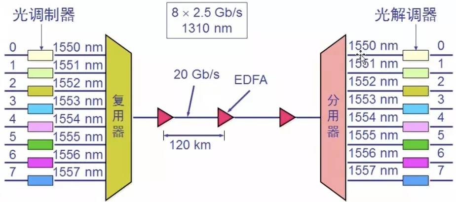

# 信道复用技术

## 一.分类

### 频分复用(FDM)

用户在分配到一定的频带后，在通信过程中时钟占用这个频带，频分复用的所有用户在同样时间内占用不同的频率宽带资源

每个电话用户都有自己的频率，在通过 调制器 调制后变成不同的频率，结合在一起，传输到对方后，通过 解调器 解调，恢复成原来的频率

### 时分复用(TDM)

将时间划分为一段段等长的时分复用帧(TDM帧), 每一个时分复用的用户在每一个TDM帧中占用固定序列号的时隙，每个用户占用的时隙是周期性地出现(周期为TDM帧的长度对应的时间)

时分复用的所有用户是在不同的时间占用同样的频带宽度

A、B、C、D用户在每个TDM帧中位置相对不变

放数据的时候按照一定的规律，一个个地放

实现机制如上，时钟指向谁，谁放，到下一次指向谁，谁放。以相同的转速和周期，以此类推地放

**缺点**: 可能造成线路资源的浪费

### 统计时分复用(STDM)

A来了a，做标记，放进第一个帧，B来了b，做标记，放进第一个帧，帧满了，换下一个帧；再放B中的第二个b，一次类推...

当到达对方时，通过标记来拆解

### 波分复用(WDM)

波的频分复用

