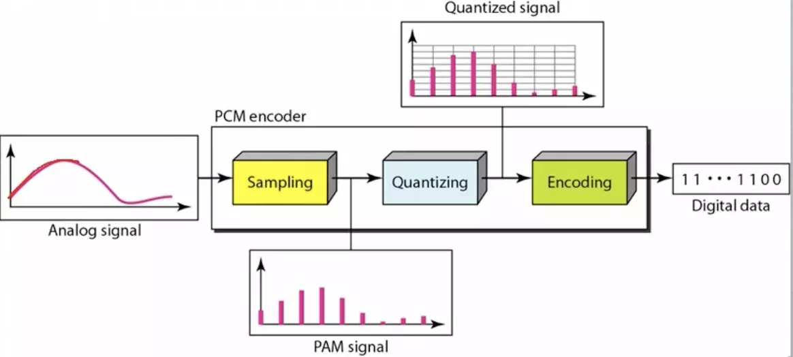
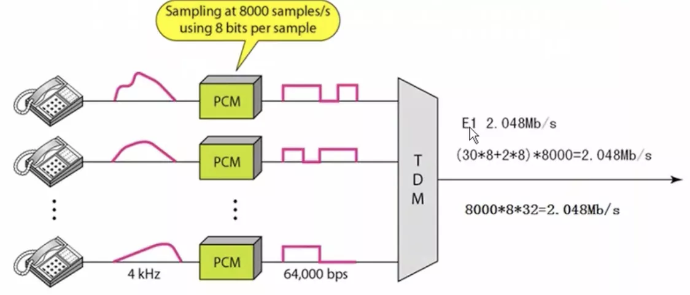
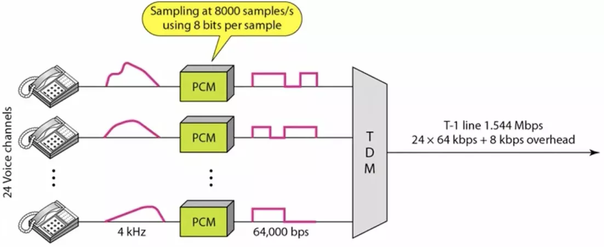

# 数字传输系统

主要是关于广域网之间的数据传输，比如北京有个局域网，上海有个局域网，则可租用电话公司的线路来实现北京与上海之间的通信

脉码调制PCM体质最初为了在电话局之间的中继线上传输多路的电话，在国际上有两个标准，北美的24路PCM(T1), 速率为1.544Mb/s, 欧洲的30路PCM(E1), 速率为2.048Mb/s

我国采用E1

当需要更高数据率时刻采用复用技术

## 原理

以电话为例:

Anolog signal: 个人声波

Sampling: 采样器采样, 8000次/s -> PAM signal, 其中的波形就是码元

Quantizing: 标准化，归整为 Quantized signal 所示, 每个码元代表8位二进制, 8 * 8000 = 64K带宽, 即打电话所需

## E1

进行32路时分复用, 即 64K * 32 = 2.048 Mb/s

## T1

进行24路时分复用, 即 64 * 24 + 8K(控制信号) = 1.544 Mb/s
