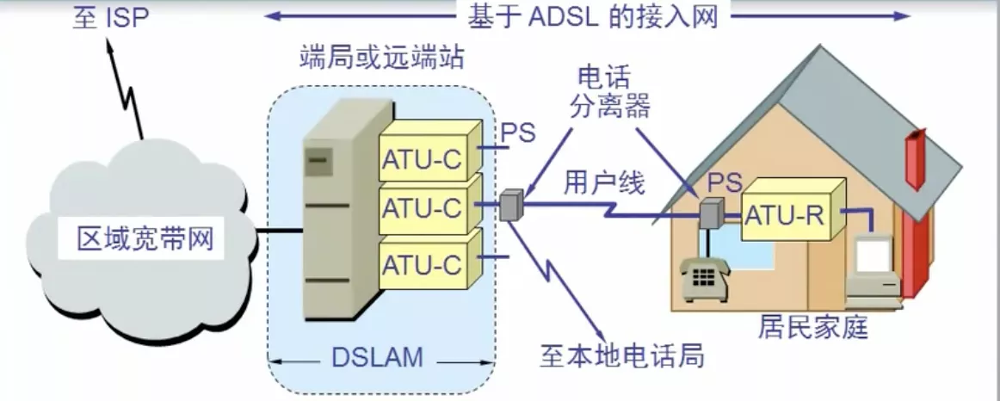
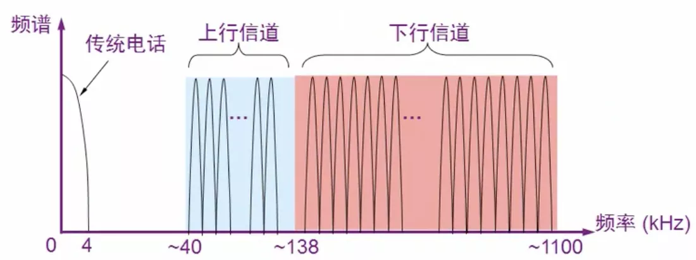
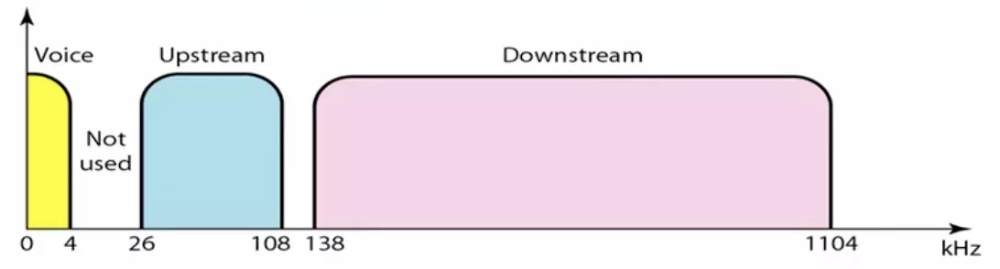
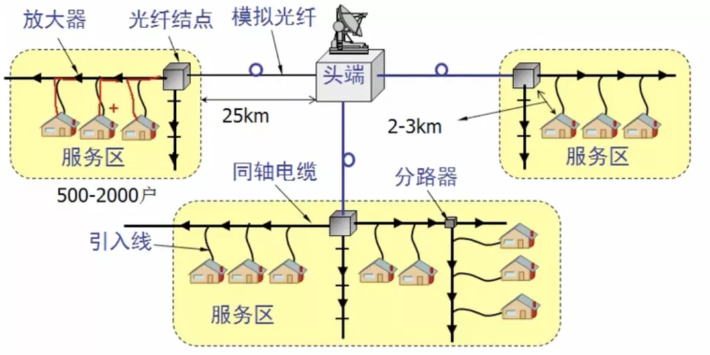

# 带宽接入技术

## 一.xDSL

用数字技术对现有的模拟电话用户线进行改造，标准模拟电话信号的频带被限制在 300~3400Hz范围，但用户线本身实际可通过的信号频率仍然超过 1MHz

xDSL技术 把 0~4KHz 低端频谱留给传统电话使用，把原来没有被利用的高端频谱留给用户上网使用

### ADSL

DSLAM: 数字用户线接入复用器

ATU: 接入端接单元ATU

ATU-C: 端局

ATU-R: 远端

用户线就是电话线, 通过电话分离器, 可接电话, 再通过ATU-R可接电脑

### 特点

上线和下行带宽做成不对称，在用户线的两端各安装一个ADSL调制解调器

### DMT调制技术

采用频分复用方法，把40kHz以上到1.1MHz的高端频谱划分为许多的子信道，其中25个子信道用于上行信道, 用于上传，249个子信道用于下行信道，用于下载

每个子信道占据4Khz带宽，并使用不同的载波(不同的音频)进行数字调制

通过并行串行转换器，上行的数据会通过并行来传，下行的数据会从并行转换为串行来传

## 二.光纤同轴混合网HFC

除可传送CATV外，还提供电话，数据和其它宽带交互性业务

现有的CATV网是树形拓扑结构的同轴电缆网络，采用模拟技术频分复用对电视节目进行单向传输

HFC网是目前覆盖面很广的有线电视网CATV的基础上开发的一种居民宽带接入网

### 结点体系结构

### 主要特点

1 主干线路采用光纤，将原CATV网中的同轴电缆主干部分改换为光纤，并使用模拟光纤技术

2 在模拟光纤中采用光的振幅调制AM，比数字光纤更经济

3 模拟光纤从头端连接到 光纤节点，即光分配节点ODN，在光纤节点光信号被转换为电信号，光纤节点一下就是同轴电缆
