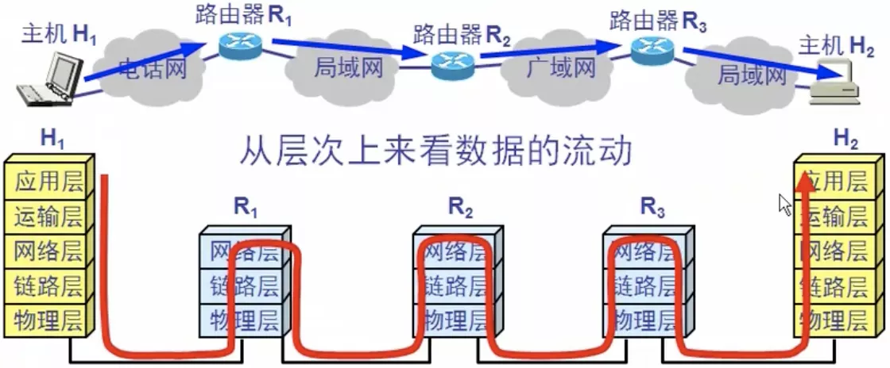
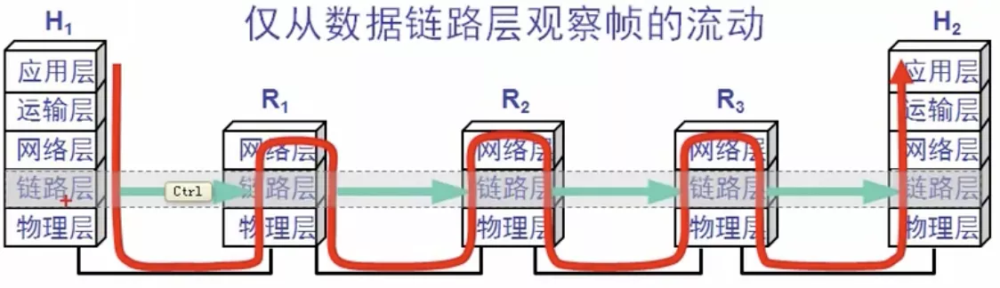

# 基本概念

链路: 一条点到点的物理线路段，中间没有任何其它的交换结点，一条链路只是一条通路的一个组成部分

数据链路: 除了物理线路外，还必须有通信协议来控制这些数据的传输，若把实现这些协议的硬件和软件加到链路上，就构成了数据链路

现最常用的方式是使用适配器(网卡)来实现这些协议的硬件和软件

一般的适配器都包括了数据链路层和物理层这两层的功能

## 一.信道类型

1 点对点信道: 使用一对一的点对点通信方式

2 广播信道: 使用一对多的广播通信方式，因广播信道上连接的主机很多，因此必须使用专用的共享信道协议来协调这些主机的数据发送

## 二.帧

数据链路层传送的是帧：IP数据包给数据链路层后，数据链路层加上帧头和帧尾进行标记，帧头的后面再跟着一个校验值，即帧内有多少个数据，最后给物理层转成二进制

常常在两个对等的数据链路层之间画一个数字管道，而在这条数字管道上传输的数据单位就是`帧`
