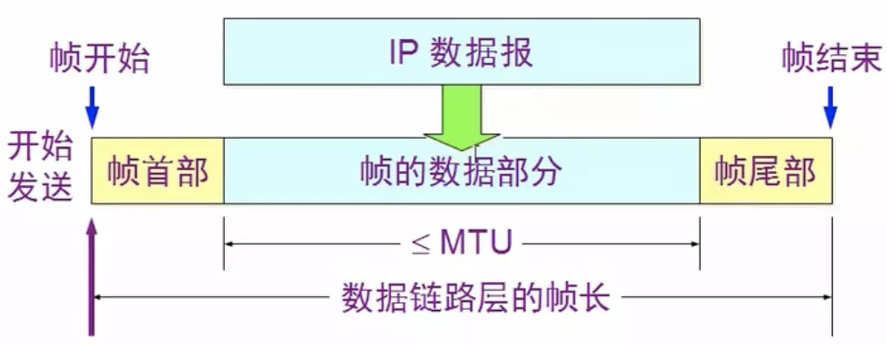
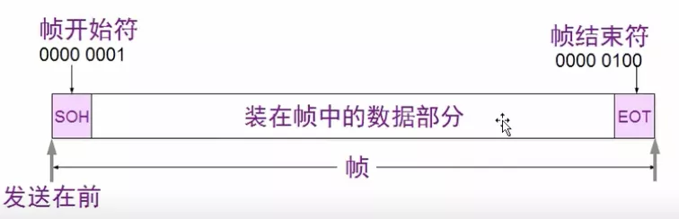
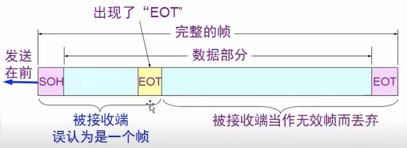
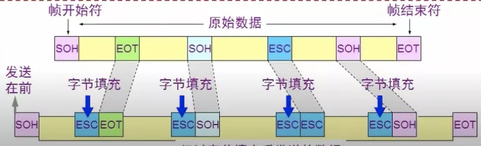
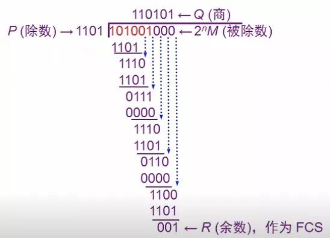

# 三个基本问题

## 一.封装成帧



在一段数据的前后分别添加首部和尾部，然后构成一个帧，确定帧的界限

### 用控制字符进行帧定界的方法举例



## 二.透明传输



发送端的数据链路层在数据中出现控制字符`SOH`或`EOT`的前面插入一个转义字符 `ESC`

如果专一字符也出现在数据当中, 那么应在转义字符前面插入一个转义字符，当接收端收到连续地两个转义字符时就会删除其中前面的一个

字节填充/字符填充: 接收端的数据链路层在将数据网络层之前删除插入的转义字符



## 三.差错检测

传输过程中可能会产生 比特差错: 1 可能变成 0 而 0 也可能变成 1

误码率: 一段时间内, 传输错误的比特占所传输比特总数的比率, 与信噪比有很大的关系

### 循环冗余检验CRC

原理: 在发送端, 将数据划分为组, 每组k比特, 假定现在传的数据是 M = 101001 (k = 6). CRC运算是在数据M后面添加供差错检测用的 n 位冗余码, 然后构成一个帧发出去, 一共发了(k + n)位

计算冗余码FCS(帧检验序列): 在M后面添加n个0, 得到(k + n)位数 除以 收发双方 事先商定的长度 (n + 1) 位的除数P, 得到 商Q(没用), 余数R(n位)

**不进位的二进制加法**:

```

    101001000
    1101
    -----
     1110   
     1101
     -----
      0111
      ....
```



所以最终数据为: 101001001

**接收端对收到的每一帧**:

检验: 得出的余数R = 0, 则判定这个帧没有差错, 就接收; 若余数R != 0, 则判断这个帧有差错, 则丢弃

```
        
             1 1 0 1 0 1
       ------------------
 1101 /1 0 1 0 0 1 0 0 1
       1 1 0 1
       ----------
         1 1 1 0
         1 1 0 1
         ---------
           0 1 1 1
           0 0 0 0
           ---------
             1 1 1 0
             1 1 0 1
             ----------
               0 1 1 0 
               0 0 0 0
               -----------
                 1 1 0 1
                 1 1 0 1
                 ----------
                   0 0 0

```

特点: 这种检测方法并不能确定究竟是哪一个或哪几个比特出现了差错; 只要经过严格的挑选, 并使用位数足够多的余数P, 那么出现检测不到的差错的概率就很小很小
