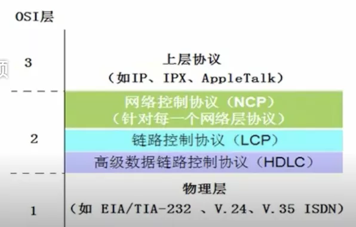
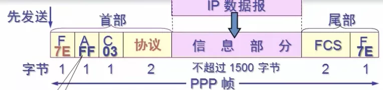

# PPP协议

用户使用 拨号电话线 接入 因特网 时一般使用的都是PPP协议

## 一.组成

1 数据链路层协议: 用于异步串行或同步串行介质

2 链路控制协议: 建立并维护数据链路链接(身份验证, 计费)

3 网络控制协议: 允许在点到点连接上使用多种网络层协议

## 二.帧格式

标志字段F: 0x7E, 开始和结束

地址字段A: 0xFF, 实际上不起作用

控制字段C: 0x03

PPP是面向字节的, 所有的PPP帧的长度都是整数字节

**协议**: 2个字节

0x0021: PPP帧的信息字段是 IP数据报

0xC021: 信息字段是PPP链路控制数据

0x8021: 表示这是网络控制数据

0xC023: 信息字段是安全性安仁PAP

0xC025: 信息字段是LQR

0xC223: 信息字段是安全性认证CHAP

## 三.字节填充

当信息字段中出现了标志字段的值:

1 将信息字段出现的每个 0x7E 字节转变为 2字节序列(0x7D, 0x5E)

2 若信息字段中出现一个 0x7D的字节, 则将其转变为2字节序列(0x7D, 0x5D)

3 若信息字段中出现 ASCII码 的控制字符(数值小于 0x20 的字符), 则在该字符前面加入一个0x7D字节, 同时将该字符的编码加以改变

