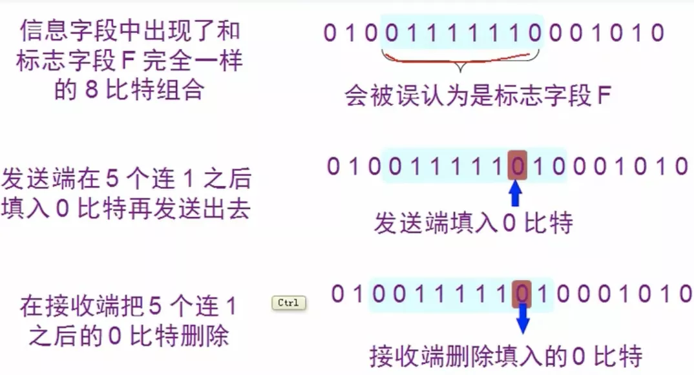

# PPP协议

用户使用 拨号电话线 接入 因特网 时一般使用的都是PPP协议

## 一.组成

1 数据链路层协议: 用于异步串行或同步串行介质

2 链路控制协议: 建立并维护数据链路链接(身份验证, 计费)

3 网络控制协议: 允许在点到点连接上使用多种网络层协议

## 二.帧格式

标志字段F: 0x7E, 开始和结束

地址字段A: 0xFF, 实际上不起作用

控制字段C: 0x03

PPP是面向字节的, 所有的PPP帧的长度都是整数字节

**协议**: 2个字节

0x0021: PPP帧的信息字段是 IP数据报

0xC021: 信息字段是PPP链路控制数据

0x8021: 表示这是网络控制数据

0xC023: 信息字段是安全性安仁PAP

0xC025: 信息字段是LQR

0xC223: 信息字段是安全性认证CHAP

## 三.字节填充

当信息字段中出现了标志字段的值:

1 将信息字段出现的每个 0x7E 字节转变为 2字节序列(0x7D, 0x5E)

2 若信息字段中出现一个 0x7D的字节, 则将其转变为2字节序列(0x7D, 0x5D)

3 若信息字段中出现 ASCII码 的控制字符(数值小于 0x20 的字符), 则在该字符前面加入一个0x7D字节, 同时将该字符的编码加以改变

## 四.零比特填充方法

PPP协议用在 SONET/SDH 链路时, 是使用同步传输(一连串的比特连续传送)。这时PPP协议采用零比特填充方法来实现透明传输

在发送端, 只要发现有5个连续1, 则立即填入一个0。接收端对帧中的比特流进行扫描, 每当发现5个连续1时, 就把这5个连续1后的一个0删除

## 五.不使用序号和确认机制

1 在数据链路层出现差错的概率不大时, 使用比较简单的PPP协议比较合理

2 在因特网环境下, PPP的信息字段放入的数据是IP数据报, 数据链路层的可靠传输并不能够保证网络层的传输也是可靠的

3 帧检验序列FCS字段可保证无差错接受

## 六.PPP协议的工作状态

1 当用户拨号接入ISP时, 路由器的调制解调器对拨号做出确认, 并建立一条物理连接

2 PC机向路由器发送一系列的LCP分组(封装成多个PPP帧)

3 这些分组及响应选择一些PPP参数, 和进行网络层配置, NCP给新接入的PC机分配一个临时的IP地址, 使PC机成为因特网上的一个主机

4 通信完毕后, NCP释放网络层连接, 收回原来分配出去的IP地址, 接着, LCP释放数据链路层连接, 最后释放的是五六里层的链接

