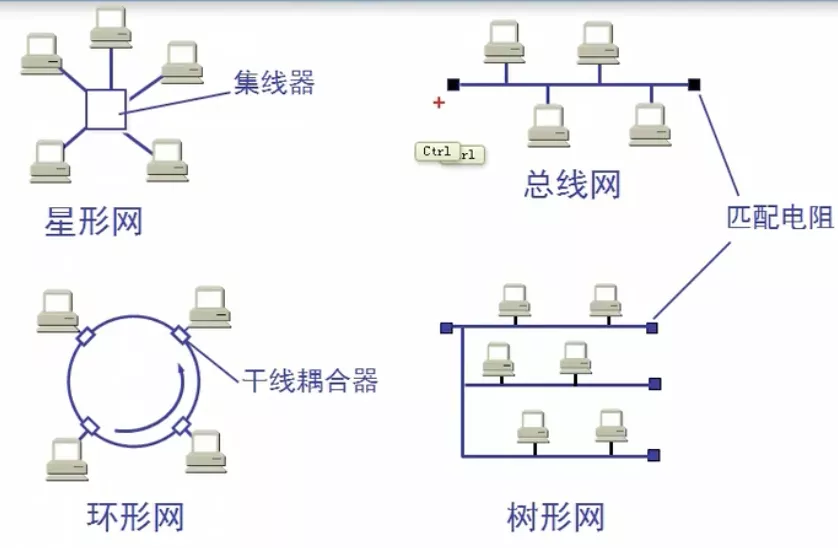

# 广播信道的数据链路层

## 一.局域网的拓扑

局域网的特点: 网络为一个单位所拥有, 且地理范围和站点数目均有限

局域网的优点:

1 具有广播功能, 从一个站点可很方便地访问全网, 局域网上的主机可共享连接在局域网上的各种硬件和软件资源

2 便于系统的扩展和逐渐地演变，各设备的位置可灵活调整和改变

3 提高了系统的可靠性, 可用性和生存性

## 二.共享通信媒体

### 2.1 静态划分信道

1 频分复用

2 时分复用

3 波分复用

4 码分复用

即统同一局域网内的两台计算机通过设置相同的频率等来通信, 不过由于太麻烦而不会在局域网中采用

### 2.2 动态媒体接入控制(多点接入)

1 随机接入(主要被以太网采用)

2 受控接入, 如多点线路探询(polling), 或轮询。(目前已不被采用)

