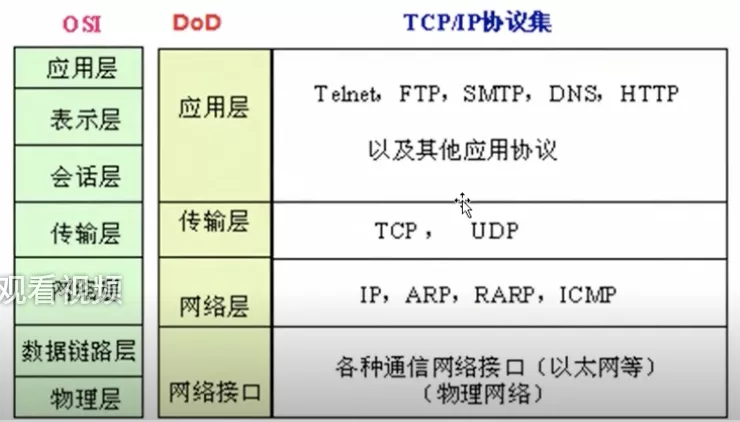
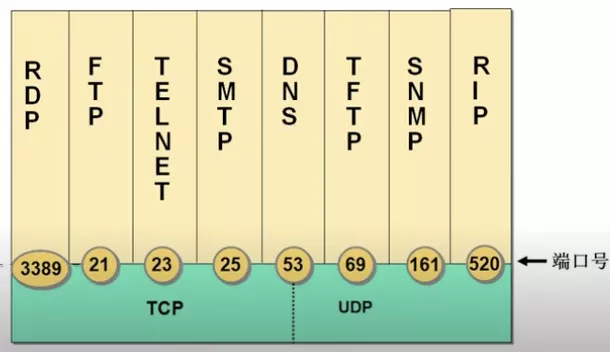

# 简介

## 一.OSI和DoD模型

## 二.TCP

需要将传输的文件分段传输, 需要建立会话，进行流量控制, 实现可靠传输

## 三.UDP

一个数据包就能完成数据通信, 不分段, 不需要建立会话, 不需要流量控制, 传输不可靠, 传送失败就再传一遍

如DNS, QQ聊天, 多播, 广播

## 四.传输层协议和应用层协议的关系

传输层协议 加上一个端口 即可标志 一个运用层协议

DNS即可用TCP也可用DNS, 但绝大多数是用UDP

**常用**:

http = tcp + 80

https = tcp + 443

ftp = tcp + 21

smtp = tcp + 25

dns = udp + 53

## 五.服务与应用层协议之间的关系

1 服务使用 TCP或UDP 的端口侦听客户端请求

2 客户端使用 IP地址 定位服务器，使用目标端口定位 服务

3 可在服务器网卡上设置只开放必要的端口，实现服务器网络安全

## 六.服务和端口及端口和安全

### 6.1 常用命令

查看建立的会话: netstat -n

查看建立会话的进程: netstat -nb

查看服务监听的端口: netstat -an

过滤某写端口: netstat -n | find "ESTABLISHED"

测试到远程计算机某个端口是否打开: telnet [IP] [port] 

