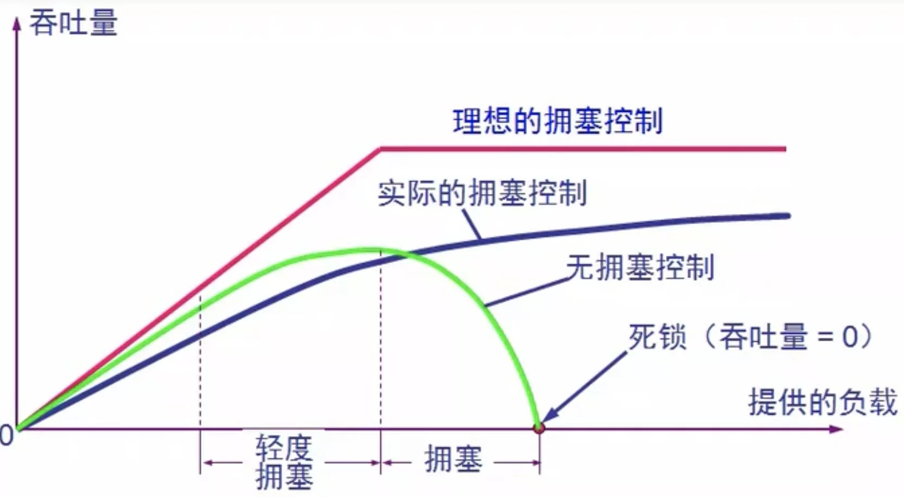
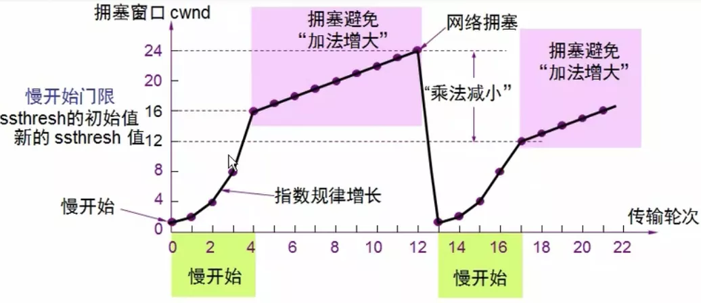
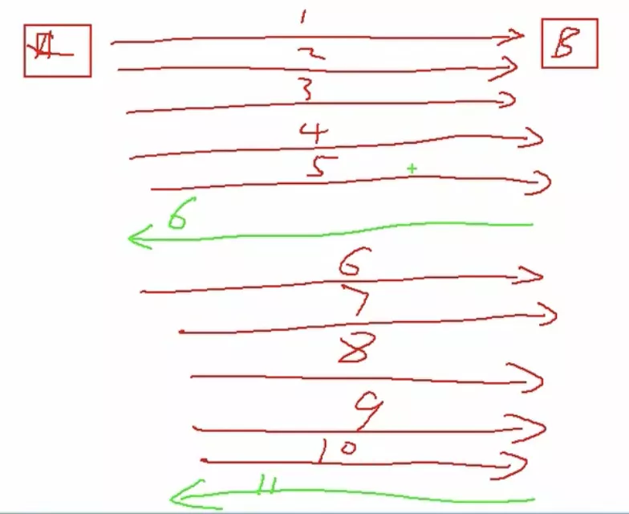
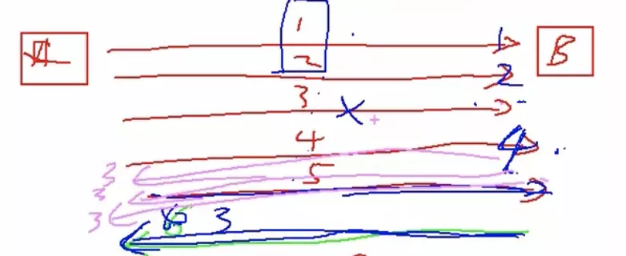
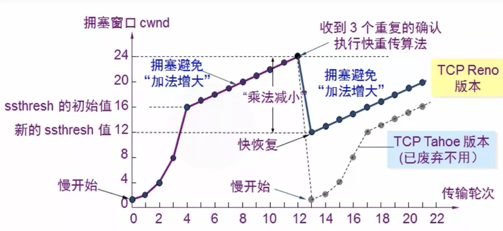

# 拥塞控制

拥塞控制: 是一个全局性的过程, 涉及到所有的主机, 所有的路由器, 以及与降低网络传输性能有关的所有因素

流量控制: 往往指在给定的发送端和接收端之间的点对点通信量的控制, 它所要做的就是抑制发送端发送数据的速率, 以便使接收端来得及接收  

出现资源拥塞的条件: 对资源需求的总和 > 可用资源

## 一.作用



## 二.实现

发送方维持 拥塞窗口cwnd(congestion window)

发送方控制拥塞窗口的原则:

1 只要网络没有出现拥塞, 拥塞窗口就再增大一些, 以便把更多的分组发送出去

2 只要网络出现拥塞, 拥塞窗口就减小一些, 以减少注入到网络中的分组数

### 2.1 慢开始


**慢开始门限ssthresh的用法**:

1 当 cwnd < ssthresh 时, 使用慢开始算法

2 当 cwnd > ssthresh 时, 停止使用慢开始算法而改用拥塞避免算法

3 当 cwnd = ssthresh 时, 既可使用 慢开始 算法, 也可使用 拥塞避免 算法

### 2.2 拥塞避免



当TCP连接进行初始化时, 将拥塞窗口置为1, 图中的窗口单位不适用字节而使用报文段

**思路**:

让 拥塞窗口cwnd 缓慢地增大, 即没经过一个往返时间RTT 就把发送方的 拥塞窗口cwnd 加1, 而非加倍, 使 拥塞窗口cwnd 按线性规律缓慢增大

**注意**:

1 并非指完全避免了拥塞, 利用以上的措施要完全避免网络拥塞还是不可能的

2 而是说 拥塞避免阶段把要是拥塞窗口控制为按线性增长, 使网络比较不容易出现拥塞

### 2.3 快重传

首先要接收方没接收一个时许的报文段后就立即发出重复确认, 这样可让发送方及早知道报文段没有到达接收方

**正常传送**: 通过累积确认, 连续发几个包, 接收方才回复下一次应该发哪一个包的序号



**若其中一个包丢了**: 若接收 1,2 后 3 没收到, 在收到 4 时则不会等累积确认, 即不会等到收到 5 时才回复 3包 丢了需重传 3,4,5 , 而是立即连续发送3个包, 表示 3包 丢了, 这样就减少了等待的时间

  

### 2.4 快恢复

当发送方接收到连续三个重复的确认时, 就执行"乘法减小"算法, 把 慢开始门限ssthresh 减半, 但拥塞窗口 cwnd 现在不设置为1, 而是设置为 慢开始门限ssthresh 减半后的数值, 然后开始执行 拥塞避免算法("加法增大"), 使用色窗口缓慢地线性增大



## 三.发送窗口的实际上限值

取 接收方窗口 和 拥塞窗口 两个变量中较小的一个:

```
发送窗口上限值 = Min[rwnd, cwnd]
```


如: 一开始 接收方B 告诉 发送方A 接收方窗口 为100, 然后 A 设置发送窗口也为100, 之后在发送的过程中若有拥塞, 就会出现拥塞窗口(肯定小于接收方窗口), 然后取两者之间较小值。就算之后网络畅通了, 也不会大于100 
