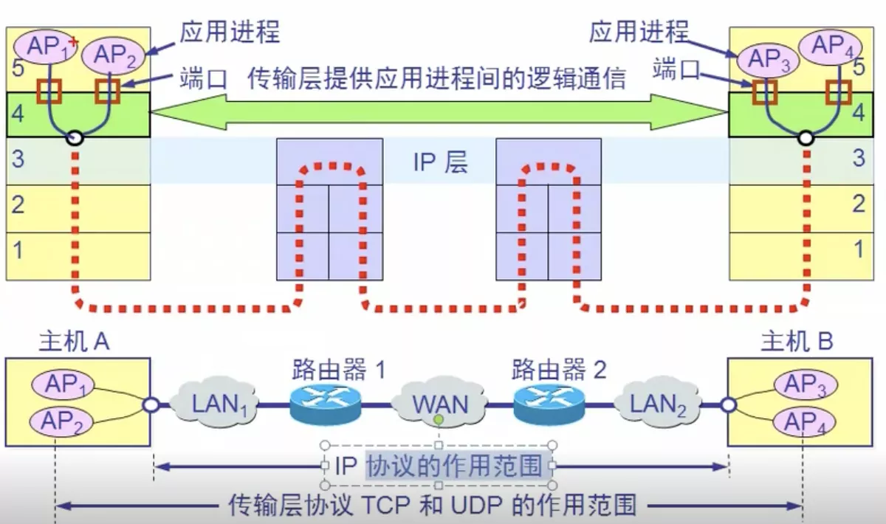

# 传输层协议功能和端口

## 一.传输层协议和网络层协议的主要区别

网络层: 提供主机之间的逻辑通信, 对收到的报文进行差错检测, 提供面向连接和无连接的服务

传输层: 提供进程之间的逻辑通信

## 二.TCP的端口

端口用一个16位端口号进行标志, 取值范围为: 0 ~ 65535

### 2.1 分类

熟知端口: 0 ~ 1023

登记端口: 1024 ~ 49151 

客户端口: 49152 ~ 65535

