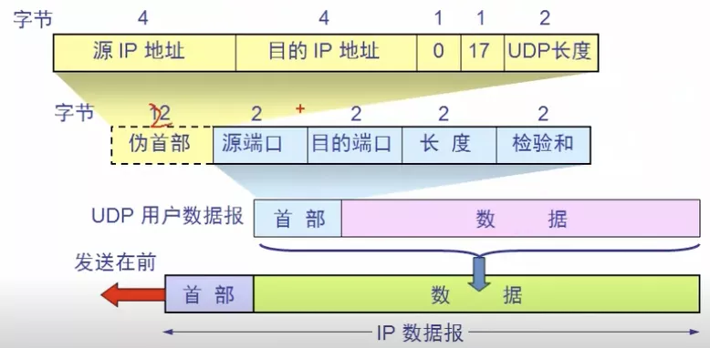
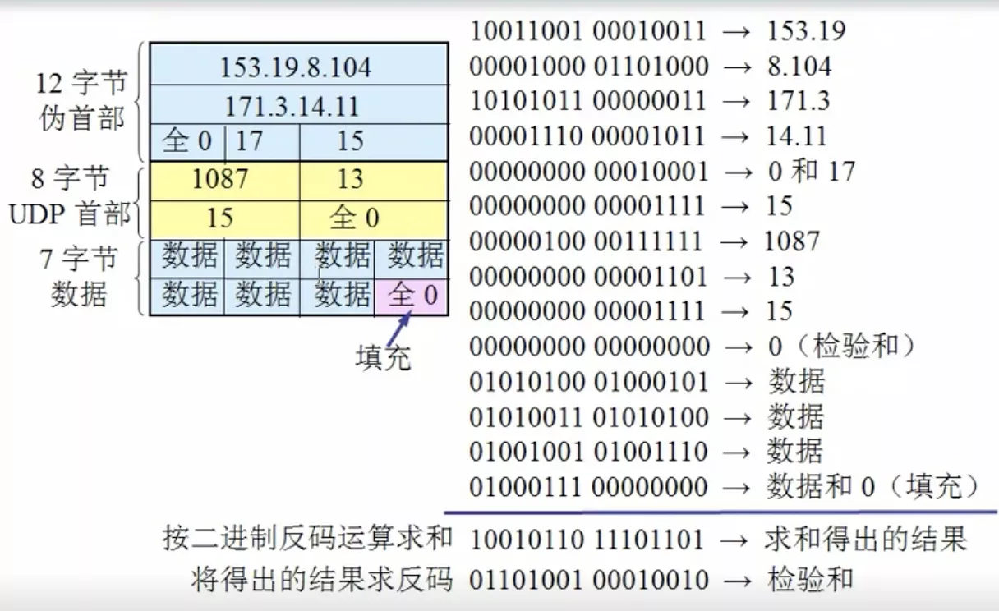

# UDP首部

## 一.UDP主要特点

1 无连接: 🈚️无三挥四握

2 使用尽最大努力交付: 既不保证可靠交付, 又不适用拥塞控制

3 面向报文: UDP没有拥塞控制, 很适合多媒体通信的要求

4 支持一对一, 一对多, 多对一 和 多对多的交互通信

5 首部开销小, 只有8个字节

## 二.首部格式

长度: 首部 + 数据

伪首部: 从网络层中首部的一些信息拿来计算, 固定12字节, 只是在计算检验和时临时添加的, 不上传也不下传, 其中17为协议号

### 2.1 计算检验和

把首部和数据部分一起检验。

在发送方, 首先将全零放入检验和字段, 再把伪首部以及UDP用户数据报看成是由许多16位的字串起来。若数据部分非偶数个字节, 则填入一个全零的字节(不发送)。然后按照二进制反码
计算这些16位字的和，得出的结果再求反码则是 检验和。

在接收方, 把收到的UDP用户数据报连同伪首部(即可能的填充全零字节)一起, 按二进制反码求出16位字的和, 当无差错时结果应全为1, 否则有差错。

此时接收方会丢弃此UDP用户数据报, 或附上差错警告交给应用层

