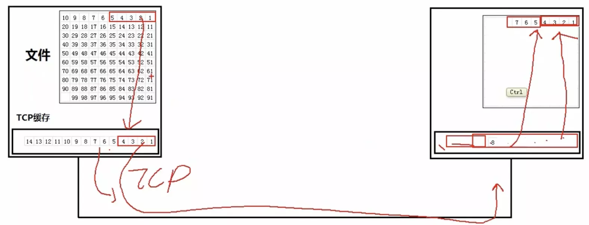
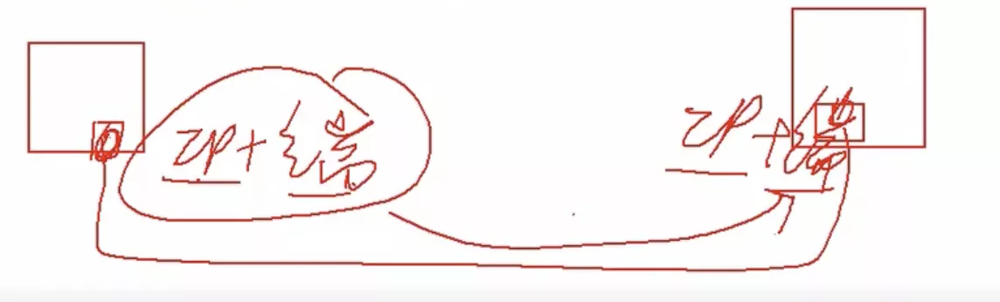

# TCP

## 一.特点

1 面向连接

2 每条TCP连接只能有两个端点, 每一条YCP连接只能是点对点的

3 提供可靠交付的服务

4 提供全双工通信

5 面向字节流

## 二.传输过程

应用程序往TCP缓存中放数据: 发送方有个文件, 有个TCP缓存区, 以字节为单位, 没规定一次放多少

传送: 从缓存中抓取一定字节(也没规定多少), 加上头, 构成一个数据包, 进行传送

接收: 把数据包放到缓存中, 去掉头, 再把字节流按照顺序组装起来

读取: 应用程序从缓存中读, 每次读的字节数也没规定, 跟之前的数据包没关系

## 三.套接字

两个应用程序之间的通讯中, TCP连接端点叫做 套接字

套接字(socket) = (IP:端口号)

每一条TCP连接唯一地被通信两端的两个断点(即两个套接字)所确定, 即 TCP连接 ::= {socket1, socket2} = {{IP1:port1}, (IP2:port2)}

// === 实际中的可靠传输：以字节为单位的滑动窗口技术 === //
// === <#comment#> === //

// === RTT(Round-Trip Time): 往返时间，性能指标，表示从发送方开始发送数据到接收到接收方的确认的时间 === //

// ===  === //
// === <#comment#> === //

// === 滑动窗口机制：可以很方便地在TCP连接上实现对发送方的流量控制 === //
// === 1 流量控制：让发送方的发送速率不要太快，要让发送方来得及接收 === //
// ===  === //