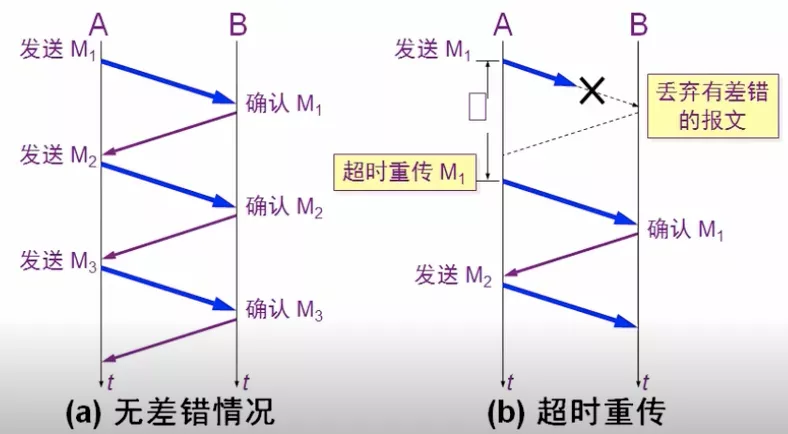
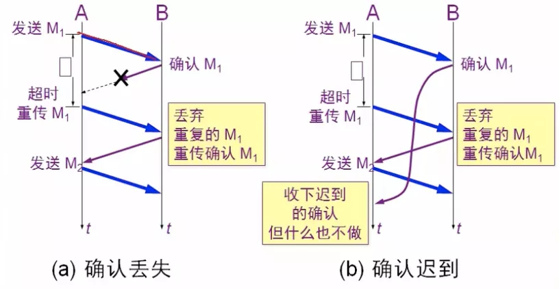
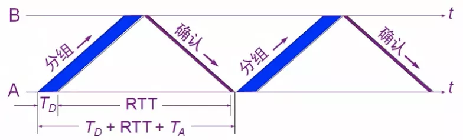
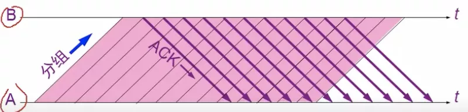
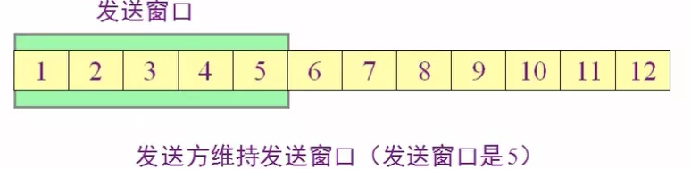
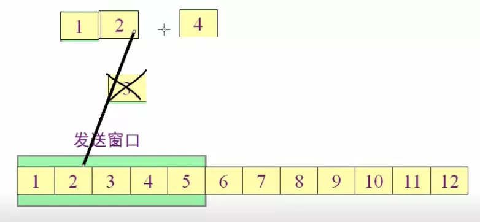

# TCP实现可靠传输

可靠传输: TCP发送的报文交给IP层传送，但IP层只能提供最大努力服务，则传输的可靠性需由TCP自己决定

## 一.停止等待协议

每发送完一个分组就停止发送，等待对方的确认，在收到确认后再发送下一个分组(传送的数据单元)

1 超时重传：发送方超过一定时间没收到接收方的确认，则认为刚发送的分组丢失，因而重传分组

1.1 实现: 发送方在每发送一次分组则设定一个 超时计时器 和 分组副本，分组要编号，才好与确认分组对应；其中时间应比分组RTT长一点，具体时间取决于分组经过哪些网络且产生的时延等；到期之前收到对方确认则撤销计时器和副本

2 确认丢失：接收方发送的 分组确认 丢失了，接收方超时没收到确认，则重传分组；此时接收方会丢弃此重复的分组，不向上层交付，并发送确认

3 确认迟到: 接收方发送确认可能选择了一条很慢的网络，发送方在超时后重传分组，接收方收到后丢弃并重传确认；而接收方收到第一个返回来的确认后，之后再收到确认分组则什么也不做

使用上述的确认和重传机制, 在不可靠的网络传输上实现了可靠的通信

这种可靠传输协议常称为 自动重传请求(ARQ)：重传的请求是自动的，接收方 无需 发送方 重传某个出错的分组

### 1.1 信道利用率

U = Ta / (Ta + RTT + Td)

发送一次的总时长：发送方发送分组所需时间(Td) + RTT + 接收方处理分组时间 + 接收方发回确认时间(Ta) + A处理分组时间

实际总时长：由于处理时间可忽略不计，则为 Td + RTT + Ta

传送有用的数据的时间：Ta

## 二.流水线传输

不使用 停止发送协议，而是 发送方 连续发送多个分组, 此方式可获得很高的信道利用率

### 2.1 连续ARQ协议

发送方每收到一个确认，就把发送窗口向前滑动一个分组的位置

假设发送窗口是5，则1~5的分组位于发送窗口，可连续发出去而无需等待对方确认。当 1 收到后，发送窗口向前移动一个单位，1 从缓存中丢弃，6 进入发送窗口，以此类推

### 2.2 累积确认

接收方在收到几个分组后对 按序到达 的最后一个分组发送确认

缺点：不能向 发送方 反映出 接收方 已经确定收到的所有分组信息；如有5个而第3个丢失了，只能先发前2个，而后3个都需要重传

