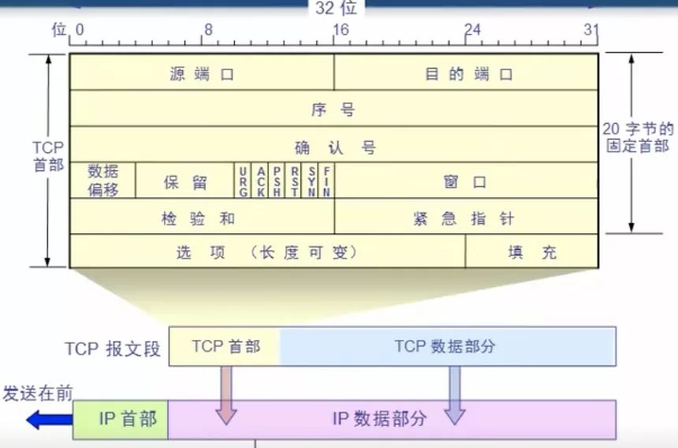
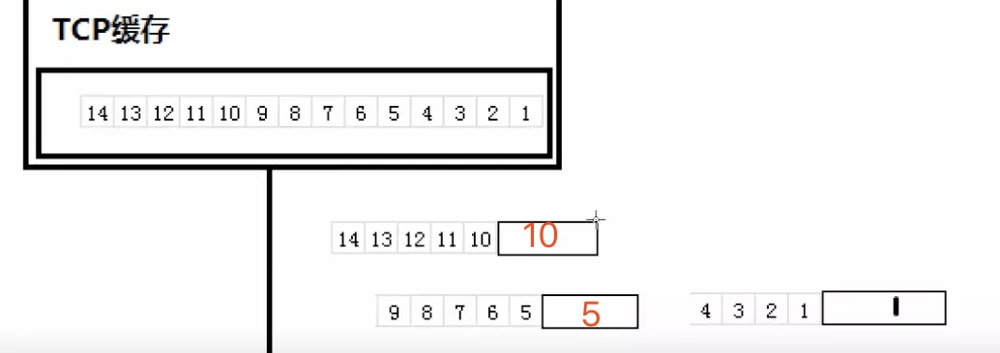
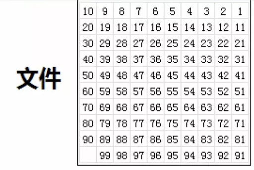
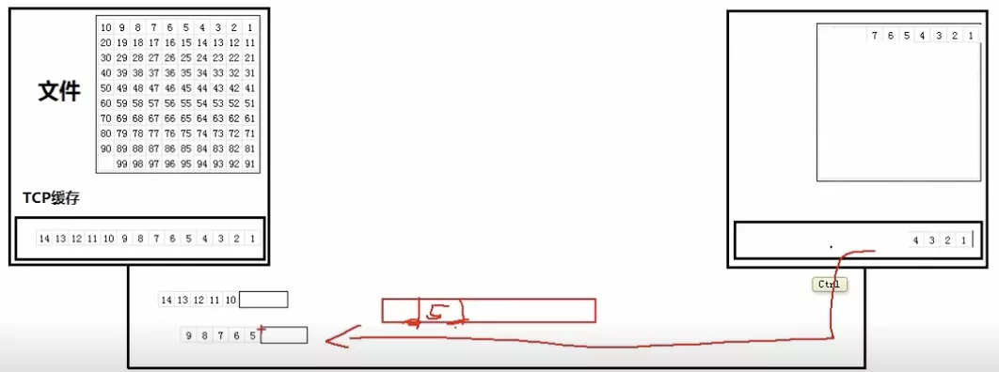
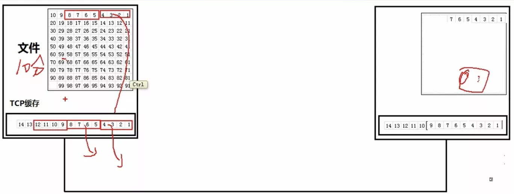
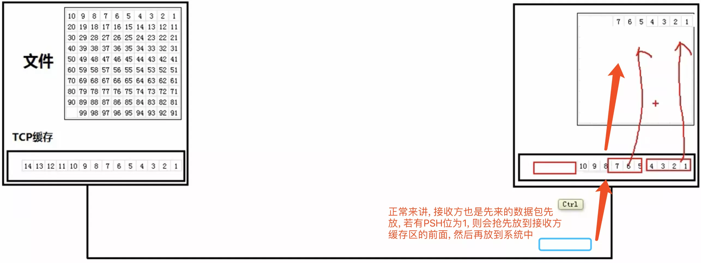

# TCP首部

TCP报文段首部: 固定20 (4字节 * 5行) 字节 + 选项(最多40字节)

目标端口/源端口: 各占2字节

**序号**：TCP是面向字节流的，在一个TCP连接中传送的字节流中的每一个字节都按顺序编号。序号则为 本报文段所发送的数据的第一个字节 的序号在 整个文件中 的序号
 
如把 4321 4个字节放到一个分组, 这个分组中第一个字节是1, 1在文件中的序号为1

**确认号**: 期望收到对方下一个报文段的第一个数据字节的序号；即确认号为N，则到 N-1 的数据都收到

如当对方收到分组4321后, 希望下一个分组发的第一个字节的序号为5, 则确认号为5

当收到确认号为5时, 则发送方会释放TCP缓存中之前的分组

**数据偏移**：由于有可能存在选项, 所以首部长度不固定, 而数据偏移则是用来记录从报文段的第几个字节开始为 数据部分

由于数据偏移只占4个字节, 最大为1111即15, 则1需要代表4个字节, 最长为 15 * 4 = 60字节；所以选项最多为 60 - 20 = 40字节

**保留**: 没有用

**URG**: 模式传输的时候回先把数据块放入缓存中, 然后依次传送, 若有 URG 标记位则可以指定顺序, 提前传送, 如为 1 则表明不用排队立即传输 

**PSH**: 若为1则会在接收方收到后尽快交付给 接收应用进程 , 而不再等到整个缓存都填满了后再向上交付

**ACK**: 若为 0 , 确认号则无效; 若为 1 , 确认号才有效

**SYN**: 在连接建立时用来同步序号

1 当ACK为0而SYN为1时: 表明为连接请求报文段

2 当ACK为1且SYN为1时: 表名为连接接受报文段

**FIN**: 用来释放一个连接, 当FIN为1时表名此报文段的发送方的数据已发送完毕, 并要求释放连接

**RST**: 若为1则表明TCP连接中出现严重差错(如主机崩溃), 必须释放连接然后重新建立连接

**窗口**: 

