# TCP传输连接管理

传输连接有三个阶段: 连接建立, 数据传送, 连接释放

TCP连接的建立采用 **客户服务器方式**: 主动发起连接建立的进程为 客户 , 被动等待连接建立的应用进程为 服务器

## 一.三次握手

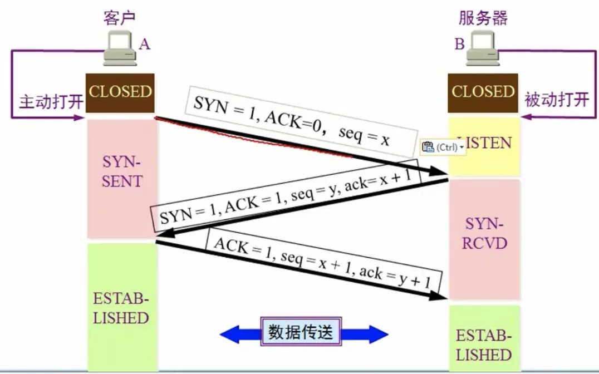

### 1.1 抓包分析

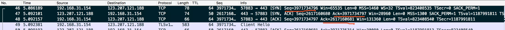

用wireshark抓了我的博客网站`https://www.hellojm.cn`的包

一开始的三个包为三次握手的包, 接下来是三个包关于TCP部分的详细分析:

1 第一个包: 由 client 发出, 可以看出, Sequence number是一个随机的很大的序列号(3971734796), 因为是第一次交互的序列号所以称为 初试序列号(ISN), 此时标志位(Flags)中只有 SYN 位为1, 其它标志位都为0。发出后 client 的进程进入 SYN-SENT(同步已发送) 状态 

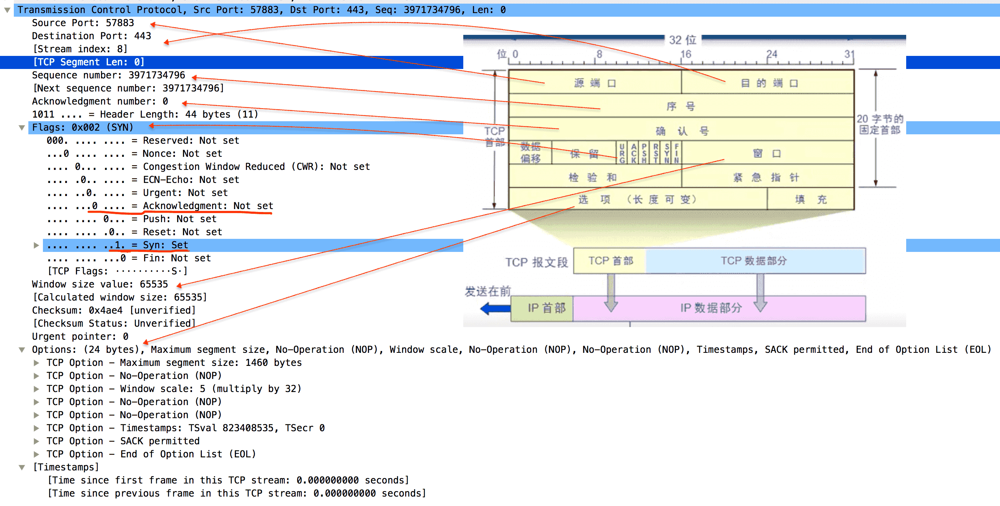

2 第二个包: 由 server 发出, 可以看出, 标志位中 SYN位 和 ACK位 都为1, 而Acknowledgment number的值为 3971734797 , 比第一个包的Sequence number值 大1, 而此包的Sequence number值又是另一个不同的随机数(2617160680)。发出后 server 的进程进入 SYN-RCVD(同步收到) 状态

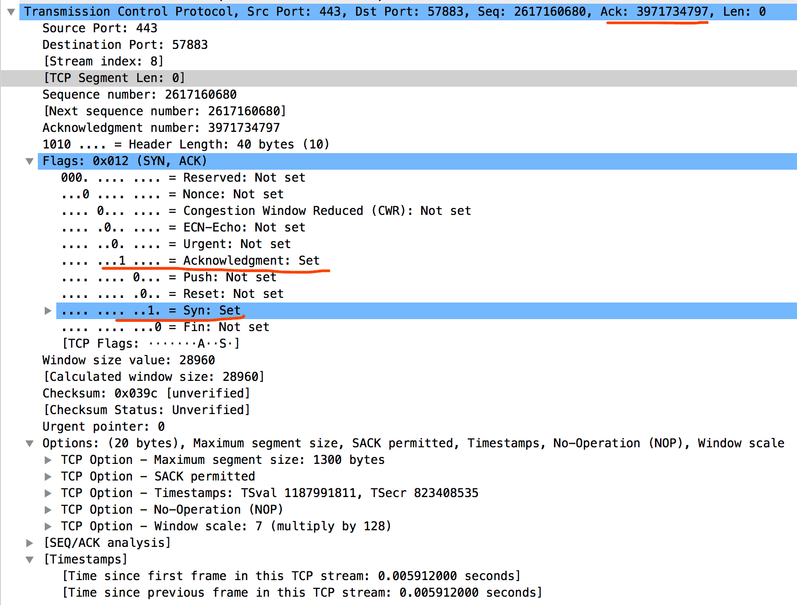

3 第三个包: 由 client 发出, 可以看出, 标志位中只有 ACK位 为1, Acknowledgment number的值为2617160681, 比上一个包的Sequence number值 大1, 而Acknowledgment number是上一个包的Sequence number值。client 发出包后 其进程进入 ESTABLISHED(已建立连接) 状态, 而 server 收到后 也进入 ESTABLISHED(已建立连接) 状态

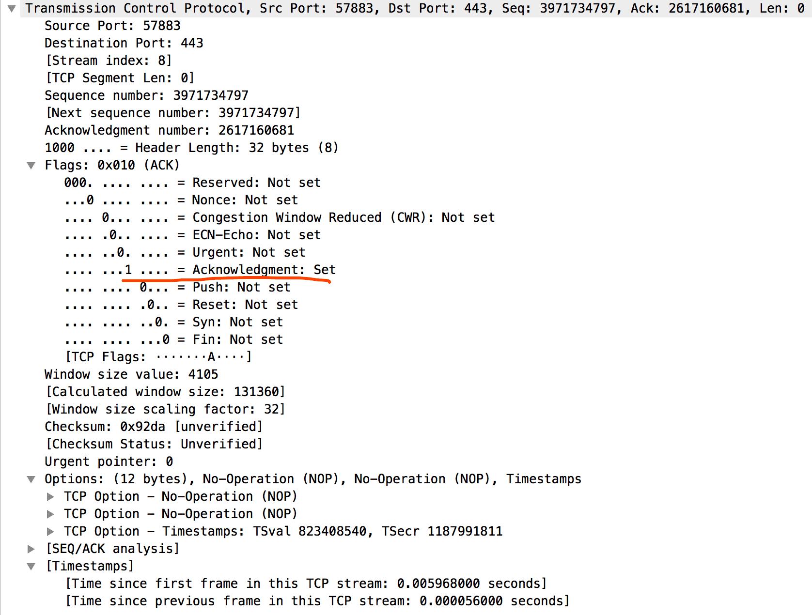

### 1.2 初始序列号是怎么算出来的?

RFC 1948 提出一个较好的ISN随机生成算法: ISN = M + F(localhost, localport, remotehost, remoteport)

M: 计算器, 每个4ms加1

F: Hash算法, 根据源IP, 目的IP, 源端口, 目的端口 生成的一个随机数值

### 1.3 为什么需要初始序列号?

1 后续数据交互过程序列号以 ISN 为基础进行增加

2 防止在网络中被延迟的分组在以后又被传送, 而导致某个连接的一方对它做出错误的解释: 序列号是增长的, 若某个包在网络中延迟了很久才发达接收方, 由于此时会有重传机制, 会有其它包发送成功, 则此时的序列号会小得可怜, 就会被丢弃

3 防止黑客进行TCP会话劫持, 重放攻击等: 黑客需要在 client 和 server 中间进行劫持, 则需要与 client 和 server 同时通话, 此时需要伪造IP以及伪造序列号, 而 ISN 的算法会使得 伪造序列号 的难度很大, 一旦错了就会被丢包

**TCP劫持工具:** Juggernaut, Hunt, Dsniffer

### 1.4 为什么是三次而非两次?

为了防止已失效的连接请求报文段突然有传送到了服务器, 因而产生错误

假若没有最后一次 client 向 server 发出的确认, 遇到了以下情况: 一开始 client 发送了一个包给 server, 但由于在某些网络结点长时间滞留而延迟到 连接释放 后才到达 server, 本来是一个很早已经失效的报文段, 但 server 收到后误认为 client 又发起了一次新的连接, 则向 client 开发出确认报文段, 同意建立连接, 然后等待 client 发来数据, 可是 client 收到后经过检验并非正确的包则会丢弃, 且不会告知 server, 则导致了 server 一直等待而浪费资源

若有第三次的确认, 则 server 因为收不到确认就知道 client 没有要求建立连接
 
## 二.四次挥手

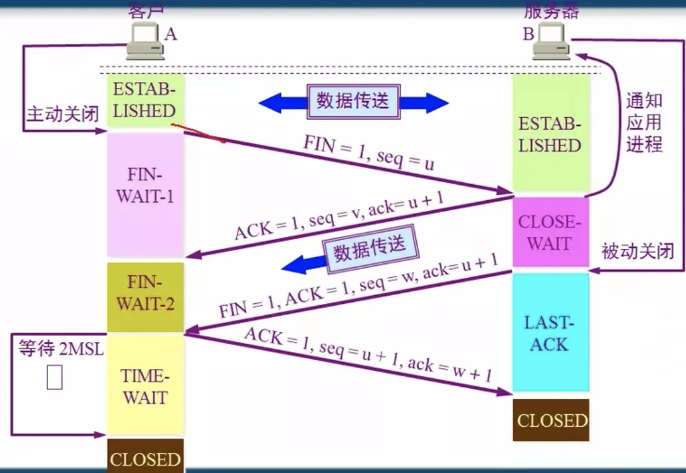

### 2.1 抓包分析

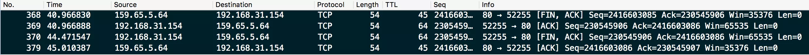

在分析我的网站`https://www.hellojm.cm`时, 怎么也抓不到四次挥手的包, 大概是用了h2协议的缘故吧, 并不能抓到很正规挥手的四个包

为了学习起见, 用了`http://reverent-thompson-95d408.netlify.com/`这个网站来抓包, 因为是http1.1的, 所以包的规律都很正规, [点此下载响应的wireshark文件](四次挥手分析.pcapng)

以下为最后结束的四个包

1 第一个包: 由 client 发出, 可以看出只有 ACK位 和 FIN位 为1, Sequence number 为一个随机数(2416603085), Acknowledgement number 为 随机数230545906。发出后 client 变为 FIN-WAIT-1(终止等待1) 状态

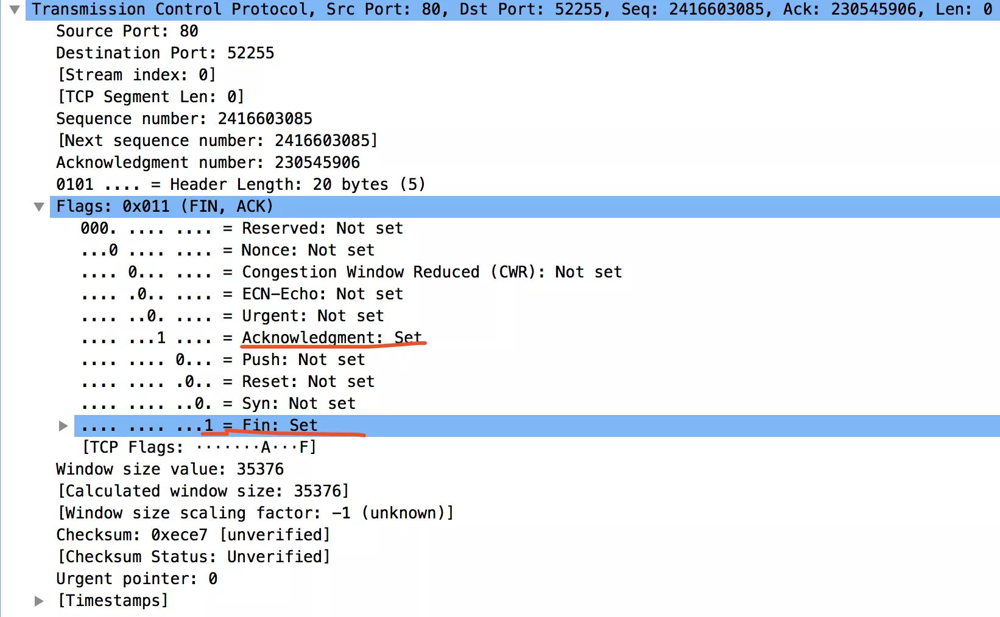

2 第二个包: 由 server 发出, 可以看出只有 ACK位 , Acknowledgement number 为 上一个包的 Sequence number +1, Sequence number 则变为了上一个包的 Acknowledgement number。发出后 server 的状态变成了 CLOSE-WAIT(关闭等待状态)

此时 server 中的TCP服务器进程会通知高层应用进程, client 到 server 的连接会释放, 但 server 到 client 的连接并未关闭, 即 TCP连接 处于 半关闭状态 , client 没有数据要发给 server , 但 server 若有数据发给 client 则 client 仍要接收

过了一段时间 client 收到 server 的确认后, 进入 FIN-WAIT-2(终止等待2) 状态

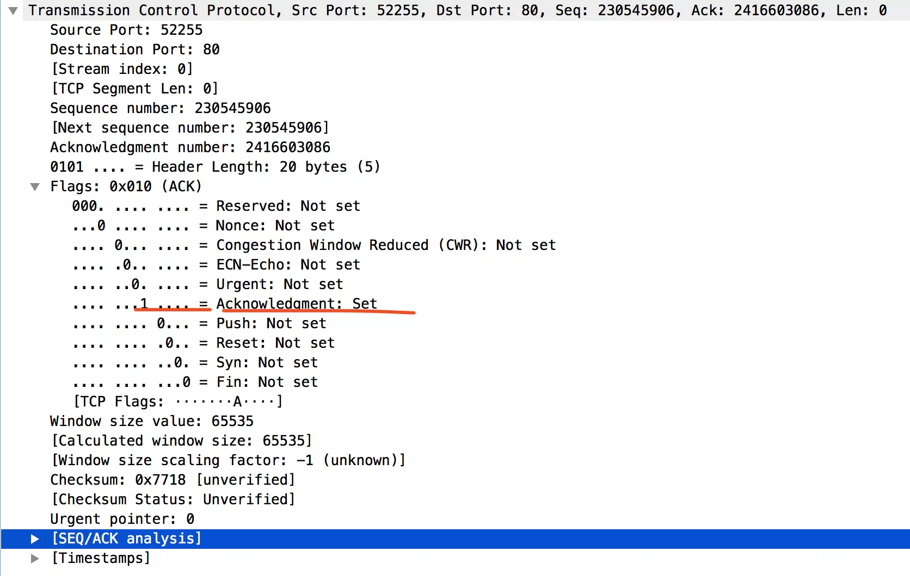

3 第三个包: 还是由 server 发出, 若 server 没有数据发送给 client , 则应用进程通知 TCP 释放连接, 发后发出报文

此时有 FIN位 和 ACK位, Acknowledgement number 和 Sequence number 依旧与上一个包的一样。发出后 server 处于 LAST-ACK 状态(最后确认状态)

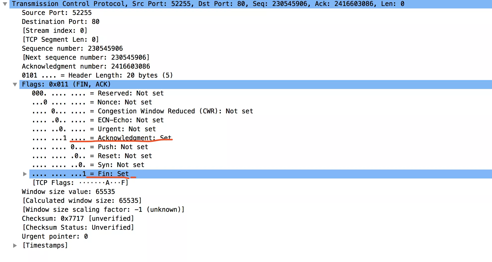

4 第四个包: 由 client 发出, 此时只有 ACK位 , Acknowledgement number 与上一个包的 Sequence number 一致, 而 Acknowledgement number 则为上一个包的 Sequence number +1。发出后 client 处于 TIME-WAIT 状态, 等待 2MSL 时间后进入 CLOSE 状态, 而 server 收到后也进入 CLOSE 状态 。当 client 撤销响应的 传输控制块TCB 后此TCP连接结束

时间由 时间等待计时器 设置, MSL 称为 最长报文段寿命

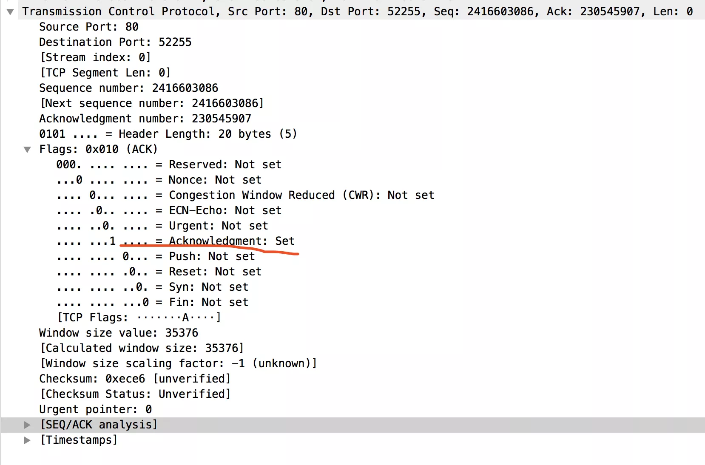

### 2.2 为什么是四次而非三次?

TCP是全双工传输的, 一方的FIN不代表另一方的数据就结束了, 另一方可能还需要发送数据, 因此第一次 server 返回确认时是处于 半关闭状态 的

### 2.3 为什么在 TIME-WAIT 状态要等待 2MSL ?

1 保证 client 发送的最后一个 ACK报文段 能到达 server: 此 ACK报文段 有可能有可能丢失, 因而使得 处于 LAST-ACK 的 server 收不到确认, 此时会重传 第三个包, 若不等待 2MSL 则有可能收不到 server 重传的 FIN + ACK

2 防止 已失效的连接请求报文段 出现在本链接中: client 发送完最后一个报文段后, 在经过 2MSL 时间, 就可以使得本连接持续的时间内所产生的所有报文段从网络中消失

