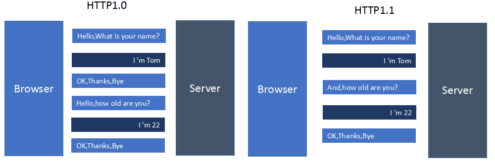
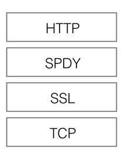
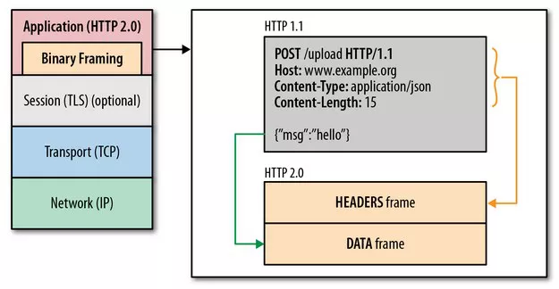
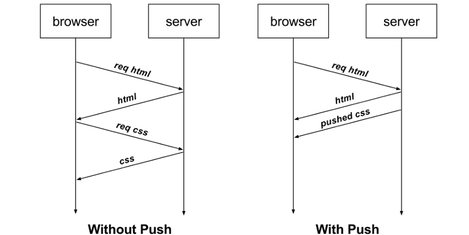
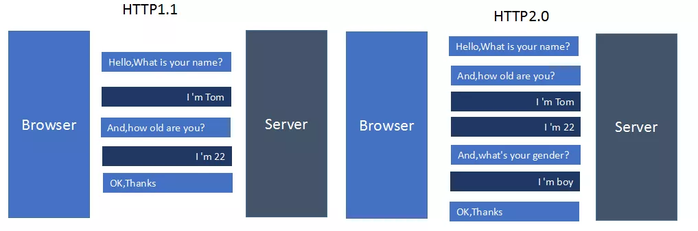

# 超文本传输协议HTTP

## 一.优化

影响一个HTTP网络请求的因素主要有两个：带宽和延迟

1 带宽: 现在基本不成问题

2 延迟:

2.1 浏览器阻塞: 浏览器对于同一域名会有最大连接数限制(因浏览器而异, 一般4个), 超过后的请求会被堵塞

2.2 DNS查询: 浏览器需要通过DNS查询出域名对应的IP才能发起请求, 可利用DNS缓存减少此时间

2.3 建立连接: HTTP基于TCP, 每次连接需三次握手和慢启动, 三次握手在高延迟的场景下影响较明显，慢启动则对文件类大请求影响较大

## 二. http1.0 与 http1.1

|                |           http1.0                 |               http1.1             |
|:---------------|:----------------------------------|:----------------------------------|
|   缓存处理      | 主要 If-Modified-Since,Expires    |   Entity tag，If-Unmodified-Since, If-Match, If-None-Match等    |    |
|   带宽优化及网络连接的使用    |   不支持断点续传功能      |    支持断点续传功能    |
|   错误通知的管理 |                                  | 新增了24个错误状态响应码: 如409（Conflict）表示请求的资源与资源的当前状态发生冲突；410（Gone）表示服务器上的某个资源被永久性的删除   |           |
|   Host头处理    |    认为每台服务器都绑定一个唯一的IP地址，因此，请求消息中的URL并没有传递主机名（hostname）  |   在一台物理服务器上可以存在多个虚拟主机（Multi-homed Web Servers），并且它们共享一个IP地址。HTTP1.1的请求消息和响应消息都应支持Host头域，且请求消息中如果没有Host头域会报告一个错误（400 Bad Request）|
|   长连接        |    |   HTTP 1.1支持长连接（PersistentConnection）和请求的流水线（Pipelining）处理，在一个TCP连接上可以传送多个HTTP请求和响应，减少了建立和关闭连接的消耗和延迟，在HTTP1.1中默认开启Connection： keep-alive，一定程度上弥补了HTTP1.0每次请求都要创建连接的缺点 |



## 三. https


### 3.1 窃听

```

  浏览器   ---->   代理服务器   ----> 链路    ----> 服务器
              |      此过程都可修改明文内容   |

```

`traceroute [url] `可以查看从浏览器到服务器都经过了哪些节点(IP + 响应时间), 通过anyproxy可以设置本地代理, 若是明文传输，则在代理中可以 查看 和 篡改 所有报文内容

### 3.2 原理


1 浏览器发起往服务器的 443 端口发起请求，请求携带了浏览器支持的加密算法和哈希算法

2 服务器收到请求，选择浏览器支持的加密算法和哈希算法。

3 服务器下将数字证书返回给浏览器，这里的数字证书可以是向某个可靠机构申请的，也可以是自制的

4 浏览器进入数字证书认证环节，这一部分是浏览器内置的 TSL 完成的

4.a 首先浏览器会从内置的证书列表中索引，找到服务器下发证书对应的机构，如果没有找到，此时就会提示用户该证书是不是由权威机构颁发，是不可信任的。如果查到了对应的机构，则取出该机构颁发的公钥

4.b 用机构的证书公钥解密得到证书的内容和证书签名，内容包括网站的网址、网站的公钥、证书的有效期等。浏览器会先验证证书签名的合法性。签名通过后，浏览器验证证书记录的网址是否和当前网址是一致的，不一致会提示用户。如果网址一致会检查证书有效期，证书过期了也会提示用户。这些都通过认证时，浏览器就可以安全使用证书中的网站公钥了

4.c 浏览器生成一个随机数 R，并使用网站公钥对 R 进行加密

5 浏览器将加密的 R 传送给服务器

6 服务器用自己的私钥解密得到 R

7 服务器以 R 为密钥使用了对称加密算法加密网页内容并传输给浏览器

8 浏览器以 R 为密钥使用之前约定好的解密算法获取网页内容

### 3.3 查看

```
chrome tools -> security
```

1 第一个是根证书机构, 负责颁发, 下面是中级证书机构, 是个代理, 负责注册, 可收费可不收费

2 电脑中(mac ->  钥匙串)可以修改证书是否瘦信任

### 3.4 使用

1 一般让代理服务器去实现, 如nginx:

2 nodejs也有相关模块

```
const httpsOptions = {
  key: fs.readFileSync(config.auth.key),
  cert: fs.readFileSync(config.auth.cert)
}
module.exports = https.createServer(httpsOptions, app.callback()).listen(config.serverPort, function (err) {
   err ? console.log(err) : console.log(`Listening at localhost: ${config.serverPort}`)
})
```

## 四.http1.1 与 https

|               |       http1.1            |    https           |
|:--------------|:-------------------------|:-------------------|
|   证书         |        不需要             |   需要向CA申请, 且少有免费  |
|   内容         |        明文              |       密文          |
|   端口         |        80                |       443        |
|   协议环境      |       运行在TCP           |    运行在SSL/TLS, SSL/TSL运行在TCP   |
|   安全         |        不安全             |       防劫持         |
|   访问速度     |         较快              |      经过SSL握手后, 对速度有和一定程度降低, 但合理优化和部署后可接受影响      |
|   服务器端CPU   |         无压力            |    大量的秘钥计算耗CPU, 只有足够的优化, 机器成本才不会增加 |

## 五.SPDY

google出的综合了HTTPS和HTTP两者优点于一体的传输协议

SPDY位于HTTP之下，TCP和SSL之上，这样可以轻松兼容老版本的HTTP协议(将HTTP1.x的内容封装成一种新的frame格式)，同时可以使用已有的SSL功能



### 5.1 特点

1 降低延迟: 针对HTTP高延迟的问题，SPDY优雅的采取了多路复用（multiplexing）。多路复用通过多个请求stream共享一个tcp连接的方式，解决了HOL blocking的问题，降低了延迟同时提高了带宽的利用率

2 请求优先级(request prioritization): 多路复用带来一个新的问题是，在连接共享的基础之上有可能会导致关键请求被阻塞。SPDY允许给每个request设置优先级，这样重要的请求就会优先得到响应。比如浏览器加载首页，首页的html内容应该优先展示，之后才是各种静态资源文件，脚本文件等加载，这样可以保证用户能第一时间看到网页内容

3 header压缩: 前面提到HTTP1.x的header很多时候都是重复多余的。选择合适的压缩算法可以减小包的大小和数量

4 基于HTTPS的加密协议传输: 大大提高了传输数据的可靠性

5 服务端推送(server push): 采用了SPDY的网页，例如我的网页有一个sytle.css的请求，在客户端收到sytle.css数据的同时，服务端会将sytle.js的文件推送给客户端，当客户端再次尝试获取sytle.js时就可以直接从缓存中获取到，不用再发请求了

## 六.http2.0

### 6.1 特点

1.二进制分帧层：应用层与传输层间; 分为HEADERS frame 与 DATA frame；文本流存在解析上复杂性因此采用二进制



2.首部压缩, server与client各存首部表: 既避免了重复header的传输，又减小了需要传输的大小

3.多路复用/连接共享：同一个TCP连接 且 并行双向字节流, 无需合并css,js,sprite, 无需多域名并行下载


4.请求优先级：优先值确定着客户端和服务器处理不同的流采取不同的优先级策略

5.服务器推送：无需base64

6.兼容性：https连接时先握手，发Client Hello包说明是否支持h2, 否则用http/1.1

### 6.2 服务器推送实现



1 spdy之前:

1.1 把外部资源合并在网页文件里面，减少 HTTP 请求: 比如，把样式表的内容写在<style>标签之中，把图片改成 Base64 编码的 Data URL

缺点: 虽然减少了 HTTP 请求，但是把不同类型的代码合并在一个文件里，违反了分工原则

1.2 资源的预加载(preload): 网页预先告诉浏览器，立即下载某些资源

```
<link rel="preload" href="/styles.css" as="style">
<link rel="preload" href="/example.png" as="image">
```

如果前一个网页就使用这个命令，预加载后一个网页需要的资源，那么用户打开后一个网页时，就会感觉速度飞快

缺点: 是提前了下载时间，并没有减少 HTTP 请求

2 nginx:

```
server {
    listen 443 ssl http2;
    server_name  localhost;

    ssl                      on;
    ssl_certificate          /etc/nginx/certs/example.crt;
    ssl_certificate_key      /etc/nginx/certs/example.key;

    ssl_session_timeout  5m;

    ssl_ciphers HIGH:!aNULL:!MD5;
    ssl_protocols SSLv3 TLSv1 TLSv1.1 TLSv1.2;
    ssl_prefer_server_ciphers   on;

    location / {
      root   /usr/share/nginx/html;
      index  index.html index.htm;
      
      ## 如果用户请求根路径/，就推送style.css和example.png
      http2_push /style.css;
      http2_push /example.png;
    }
}
```

3 缓存问题: 所要推送的资源文件，如果浏览器已经有缓存，推送就是浪费带宽。即使推送的文件版本更新，浏览器也会优先使用本地缓存

解决: 只对第一次访问的用户开启服务器推送, 根据 Cookie 判断是否为第一次访问

```
server {
    listen 443 ssl http2 default_server;

    ssl_certificate ssl/certificate.pem;
    ssl_certificate_key ssl/key.pem;

    root /var/www/html;
    http2_push_preload on;

    location = /demo.html {
        add_header Set-Cookie "session=1";
        add_header Link $resources;
    }
}


map $http_cookie $resources {
    "~*session=1" "";
    default "</style.css>; as=style; rel=preload";
}
```

## 七.http2.0 与 spdy

|           |   spdy            |       http2.0         |
|:----------|:------------------|:----------------------|
| 内容       |    强制SSL加密     |   支持明文 HTTP 传输    |
| 消息头的压缩算法  |    HPACK     |    DEFLATE            |

## 八.http2.0 与 http1.1


