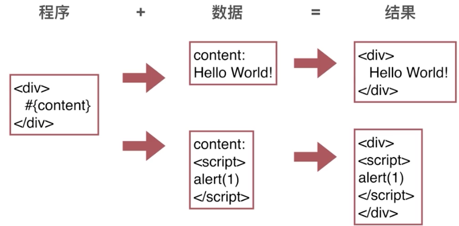
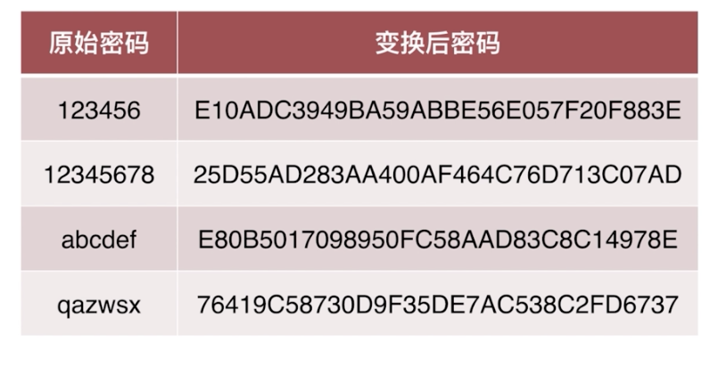

# web安全防御

---

## 一.XSS

### 攻击原理

程序 + 数据 = 结果，而通常数据加入了其它网站的脚本，从而使得数据也变成了包含其它网站脚本程序的数据



---

### 危害

1. 获取页面数据：偷取网站任意数据

2. 获取Cookies：获得登录态，从而进行csrf攻击

3. 劫持前端逻辑：去到钓鱼网站

4. 发送请求：欺骗用户

。。。

---

### 攻击类型

1. 反射型

关键：uri参数直接注入

途径：短网址

2. 存储型

关键：存储到DB后读取时注入

3. DOM-base型

关键：改版了html原有结构，如转义掉了字符或提前闭合掉了标签，为跨站的脚本代码提供了执行环境

4. 攻击注入点

1. HTML节点内容：节点动态生成，且包含了用户输入的信息

```html
<div>                        <div>
  {content}       ==》         <script > xxxx </script>
</div>                       </div>
```

2. HTML属性：某个属性值由用户输入组成

```html
   ==》    
```

3. Javascript代码：某段js代码包含了由用户注入的信息，如从后端出来的变量

```javascript
var data = "#{data}"    ==》     var data = "hello";alert(1);"";
```

4. 富文本：既要保持格式，且HTML有XSS攻击风险

---

### 防御

#### 浏览器自带拦截

字段：X-XSS-Protection

范围：HTML节点内容 和 HTML属性

#### 实体转义

```
html环境:     
< : '&lt;'
> : '&gt;'

html属性环境:
& : '&amp;'
" : '&quto;'
' : '&#39;'
```

#### js转义

`\`转义

#### 富文本过滤

1. 黑名单：给出不通过的代码

例子：`<script>`, `javascript:;`, `onerror`, ...

缺点：太多要考虑

2. 白名单：给出通过的代码，其它一律不通过

例子： `img: src, alt, title`

3. 时机：输入检出 / 输出检查

4. 插件：xss

---

### CSP

---

## 二.密码

### 作用：证明你是你

```
                       对比
存储的密码           <-------->             输入的密码
```

---

### 泄露渠道

1. 数据库被偷

2. 服务器被入侵

3. 通讯被窃听

4. 内部人员泄露数据

5. 其它网站(撞库)

---

### 哈希算法

1. 明文 - 密文 一一对应

2. 雪崩效应：差一个字符就会差别很大

3. 密文 - 明文 无法反推

4. 密文固定长度

5. 常见哈希算法：md5 / sha1 / sha256



---

### 密码存储安全性

1. 严禁明文存储 - 防泄漏

2. 单项变换 - 防泄漏

3. 变化复杂度要求 - 防猜解， 比如`md5(sha256(sha1(明文))) = 密文` 哈希后再哈希 来防止 单向变换彩虹表

4. 密码复杂度要求 - 防猜解

5. 加盐 - 防猜解


---

### 密码传输安全性

1. https传输

2. 频率限制 - 防猜解

3. 前端加密 - 防撞库，即原始密码不被拿到，这样在其它网站若用了相同的账号和密码也有保障

---

### 生物密码

1. 种类：指纹 / 虹膜 / 唇纹 / 脸部识别

2. 缺点：唯一性及不可变性，使得一旦被破解或者仿照则会发生永久失效

---

### 总结

1. 前端需要hash加密，为的是即使在传输过程被监听到也只是拿到加密的密码，而非原码，而加密不可逆，虽然黑客可以照样拿着密码去登录此网站，但是等不了其它网站，因为加密方式不同

2. 而到了后端，需要先check下此账号是否存在，存在的话再将此账号用户的盐与传过来的密码进行加密，得出来的密码去与数据库中的密码对比是否一致，这样做的目的是增加复杂度，即使被盗库，黑客也拿不到原密码

3. 加密的目的只是**最大程度地不让黑客即使拿到密码也破解不出原密码**

---

## 三.CSRF

### 攻击原理


---

### 攻击危害

1. 利用用户登录态：盗取用户资金(转账 / 消费)

2. 用户不知情：冒充用户发帖背锅

3. 完成业务请求：损坏网站名誉

...

---

### 攻击特征及防御手段

1. B网站向A网站请求

2. 带A网站的cookie: samesite

3. 不访问A网站前端：在前端页面加入验证信息 - 验证码 / token

4. referer为B网站: 验证referer

---

### 验证码

ccap

---

## 四.Cookies

### 使用特性

1. 前端数据存储

2. 后端通过http头设置

3. 请求时通过http头传给后端

4. 前端可读写

5. 遵守同源策略

---

### 代码特性

1. 域名

2. 有效期

3. 路径

4. httpOnly

5. sameSite

6. secure

---

### 作用

1. 存储个性化设置

2. 存储未登录时用户唯一标识

3. 存储已登录用户的凭证

4. 存储其它业务数据

---

### 登录用户凭证

#### 步骤

1. 前端提交用户名和密码

2. 后端验证用户名和密码

3. 后端通过http头设置用户凭证

4. 后续访问时后端先验证用户凭证

#### 方式

1. 用户ID: uid

2. 用户ID + 签名: uid + sign

3. sessionId

持久化

4. token

---

### Cookies 与 XSS的关系

XSS可能偷取Cookies：httpOnly

---

### Cookies 与 CSRF的关系

1. CSRF利用了用户Cookies

2. 攻击站点无法读写Cookies

3. 最好能阻止第三方使用Cookies

---

### 安全策略

1. 签名放篡改

2. 私有变换(加密)

3. httpOnly / sameSite / secure

---

## 五.DDOS

### 原理

1. 模拟正常用户

2. 大量占用服务器资源

3. 无法服务正常用户

### 类型

1. TCP

---

## 六.点击劫持

### 定义

将目标网站放入iframe中，视觉上隐藏，并指导用户操作

### 特点

1. 用户亲手操作

2. 用户不知情

### 危害

1. 盗取用户资金(转账)

2. 获取用户敏感信息

...

### 防御

1. Javascript禁止内嵌，但sandbox能禁止js

2. X-Frame-Options

3. 其它辅助手段：增加用户操作成本，如验证码


